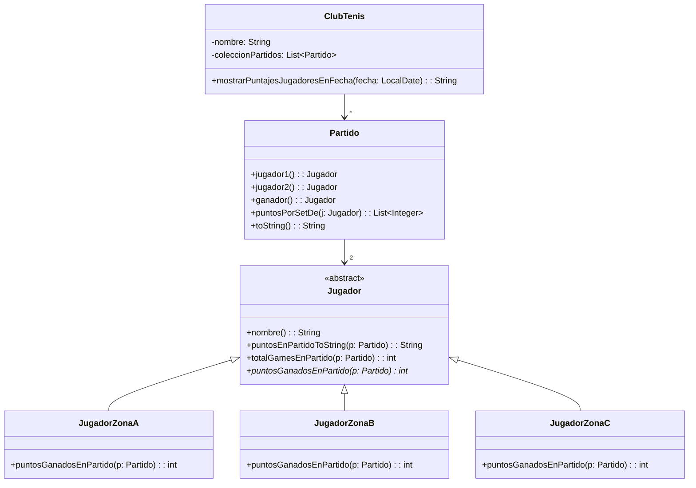

# 📘 Clase 2: Catálogo de Refactoring, Ejemplo Práctico y Herramientas

**Materia:** Orientación a Objetos 2 (OO2) — UNLP 2026  
**Docente:** Dra. Alejandra Garrido  
**Temas:** Catálogo completo de Code Smells, catálogo de Refactorings por categoría, ejemplo integrador (Club de Tenis), Herramientas automáticas y AST.

---

# Parte A: ¿Por qué es importante el Refactoring?

- **Ganar comprensión** del código.
- **Reducir el costo** de mantenimiento ante los cambios inevitables.
- **Facilitar la detección de bugs.**
- La clave: poder **agregar funcionalidad más rápido** después de refactorizar.

### Código CLEAN

El refactoring nos lleva a tener código **CLEAN**:

| Letra | Significado |
|---|---|
| **C** | Cohesive (Cohesivo) |
| **L** | Loosely coupled (Bajo acoplamiento) |
| **E** | Encapsulated (Encapsulado) |
| **A** | Assertive (Asertivo: cada objeto hace su parte) |
| **N** | Non-redundant (No redundante) |

Y además: **legible**.

---

# Parte B: Catálogo Completo de Code Smells

## 👃 Descripción de cada Mal Olor

### Código Duplicado (*Duplicate Code*)
- El mismo código, o muy similar, aparece en muchos lugares.
- **Problemas:** Código más largo de lo necesario. Difícil de cambiar. Un bug fix en un clon no se propaga fácilmente a los demás.

### Clase Grande (*Large Class*)
- Una clase intenta hacer demasiado trabajo (muchas variables, muchos métodos).
- **Problema:** Baja cohesión. Algunos métodos pueden pertenecer a otra clase.

### Método Largo (*Long Method*)
- Un método tiene muchas LOC (>20-30 líneas, depende del lenguaje).
- **Problema:** Cuanto más largo, más difícil de entender, cambiar y reusar.

### Envidia de Atributo (*Feature Envy*)
- Un método usa principalmente datos y métodos de **otra clase** para hacer su trabajo.
- **Problema:** Indica que el método fue ubicado en la clase incorrecta. Los datos y las acciones sobre esos datos deberían vivir en la misma clase.

### Clase de Datos (*Data Class*)
- Una clase que solo tiene variables y getters/setters, actúa como contenedor pasivo.
- **Problema:** Generalmente otras clases tienen Feature Envy hacia ella. Indica diseño procedural.

### Condicionales (*Switch Statements*)
- Sentencias condicionales que contienen lógica para diferentes tipos de objetos.
- **Problema:** La misma estructura condicional aparece repetida en muchos lugares. Indica la necesidad de crear subclases.

### Lista de Parámetros Larga (*Long Parameter List*)
- Un método con demasiados parámetros es difícil de entender y reusar.
- **Excepción:** Cuando intencionalmente no queremos crear una dependencia entre el llamador y el llamado.

---

## 📊 Categorización de Code Smells (Clasificación Académica)

| Categoría | Descripción | Ejemplos |
|---|---|---|
| **Bloaters** | Código que creció demasiado | Long Method, Large Class, Long Param List |
| **Tool Abusers** | Mal uso de mecanismos OO | Switch Statements, Refused Bequest |
| **Change Preventers** | Código que obstaculiza el cambio | Divergent Change, Shotgun Surgery |
| **Dispensables** | Código innecesario | Duplicate Code, Dead Code, Comments |
| **Couplers** | Acoplamiento excesivo entre clases | Feature Envy, Inappropriate Intimacy, Message Chains |

---

## 🔗 Tabla: Mal Olor → Refactoring Sugerido

### Grupo 1: Olores Clásicos

| Mal Olor | Refactorings Sugeridos |
|---|---|
| **Código Duplicado** | Extract Method, Pull Up Method, Form Template Method |
| **Método Largo** | Extract Method, Decompose Conditional, Replace Temp with Query |
| **Clase Grande** | Extract Class, Extract Subclass |
| **Muchos Parámetros** | Replace Parameter with Method, Preserve Whole Object, Introduce Parameter Object |

### Grupo 2: Diseño

| Mal Olor | Refactorings Sugeridos |
|---|---|
| **Cambios Divergentes** | Extract Class |
| **Shotgun Surgery** | Move Method / Move Field |
| **Feature Envy** | Move Method |
| **Data Class** | Move Method |
| **Switch Statements** | Replace Conditional with Polymorphism |
| **Generalidad Especulativa** | Collapse Hierarchy, Inline Class, Remove Parameter |

### Grupo 3: Comunicación

| Mal Olor | Refactorings Sugeridos |
|---|---|
| **Cadena de Mensajes** | Hide Delegate, Extract Method + Move Method |
| **Middle Man** | Remove Middle Man |
| **Inappropriate Intimacy** | Move Method / Move Field |
| **Legado Rechazado** | Push Down Method / Push Down Field |
| **Comentarios** | Extract Method, Rename Method |

---

# Parte C: Catálogo de Refactorings por Categoría

## 📁 Organización del Catálogo de Fowler

Cada refactoring tiene: **Nombre**, **Motivación**, **Mecánica** y **Ejemplo**.

---

### 1. Composición de Métodos
*Permiten "distribuir" el código adecuadamente. Los métodos largos son problemáticos porque contienen mucha información y lógica compleja.*

#### Extract Method
**Motivación:** Métodos largos, métodos muy comentados, incrementar reuso y legibilidad.

**Precondiciones:**
1. La porción de código a extraer debe contener una **unidad sintáctica completa** (expresión, sentencia, estructura de control).
2. La porción puede modificar **como máximo 1 variable temporal** que se use luego (ese será el retorno). Si hay más de una variable modificada, **no se puede extraer**.

**Mecánica:**
1. Crear un nuevo método cuyo nombre explique su propósito.
2. Copiar el código a extraer al nuevo método.
3. Revisar las variables locales del original.
4. Si alguna se usa solo en el código extraído → mover su declaración.
5. Si alguna variable local es modificada → tratarla como query y asignar su retorno.
6. Pasar como parámetro las variables que el método nuevo lee.
7. Compilar.
8. Reemplazar código en método original por llamada al nuevo método.
9. Compilar y testear.

#### Replace Temp with Query
**Motivación:** Las temporales, al ser locales, **fomentan métodos largos**. Reemplazándolas por un método, la expresión puede ser usada desde otros métodos.

**Mecánica:**
1. Encontrar las variables temporales con **una sola asignación** (si no, Split Temporary Variable primero).
2. Extraer el lado derecho de la asignación en un nuevo método.
3. Reemplazar **todas** las referencias de la variable temporal por el nuevo método.
4. Eliminar la declaración de la variable temporal.
5. Compilar y testear.

#### Otros de esta categoría (mencionados):
- Inline Method, Split Temporary Variable, Replace Method with Method Object, Substitute Algorithm.

---

### 2. Mover Aspectos entre Objetos
*Ayudan a mejorar la asignación de responsabilidades.*

#### Move Method
**Motivación:** Un método está usando (o usará) muchos servicios de una clase diferente a la suya (*Feature Envy*).

**Precondiciones (para mover M1 de clase A a clase B):**
1. B **no debe contener** una definición de M1, ni heredarla.
2. No debe haber otra definición de M1 en la superclase ni subclases de A.
3. M1 **no debe modificar** variables de instancia de A.
4. M1 debe poder **acceder desde B** a todo lo que podía acceder desde A.

**Mecánica:**
1. Revisar otros atributos/métodos en la clase original (puede que también haya que moverlos).
2. Chequear sub/superclases por si hay otras declaraciones del método.
3. Declarar el método en la clase destino.
4. Copiar y ajustar el código (ajustando referencias origen → destino).
5. Convertir el método original en una **delegación**.
6. Compilar y testear.
7. Decidir si eliminar el método original → eliminar las referencias.
8. Compilar y testear.

#### Otros de esta categoría (mencionados):
- Move Field, Extract Class, Inline Class, Remove Middle Man, Hide Delegate.

---

### 3. Manipulación de la Generalización
*Ayudan a mejorar las jerarquías de clases.*

#### Pull Up Method (Detallado)
1. Asegurarse de que los métodos sean **idénticos**. Si no, parametrizar.
2. Si el selector del método es diferente en cada subclase → **renombrar**.
3. Si el método llama a otro que no está en la superclase → declararlo como **abstracto** en la superclase.
4. Si el método llama a un atributo de las subclases → usar **Pull Up Field** o **Self Encapsulate Field** + getters abstractos.
5. Crear un nuevo método en la superclase, copiar el cuerpo, ajustar, compilar.
6. Borrar el método de una subclase → compilar y testear → repetir.

#### Replace Conditional with Polymorphism
1. Crear la **jerarquía de clases** necesaria.
2. Si el condicional es parte de un método largo → **Extract Method** primero.
3. Por cada subclase: crear un método que sobreescribe el que contiene el condicional, copiar el código del branch correspondiente, compilar y testear, borrar ese branch de la superclase.
4. Hacer que el método en la superclase sea **abstracto**.

#### Otros de esta categoría (mencionados):
- Push Down Field/Method, Pull Up Constructor Body, Extract Subclass/Superclass, Collapse Hierarchy, Replace Inheritance with Delegation.

---

### 4. Organización de Datos
- Self Encapsulate Field, Encapsulate Field/Collection
- Replace Data Value with Object
- Replace Array with Object
- Replace Magic Number with Symbolic Constant

### 5. Simplificación de Expresiones Condicionales
- Decompose Conditional, Consolidate Conditional Expression
- Consolidate Duplicate Conditional Fragments
- Replace Conditional with Polymorphism

### 6. Simplificación de Invocación de Métodos
- **Rename Method**, Preserve Whole Object
- Introduce Parameter Object, Parameterize Method

---

# Parte D: Ejemplo Integrador — Club de Tenis 🎾

El PDF presenta una transformación completa paso a paso de un sistema real.

## Situación Inicial (Código "Sucio")

```java
public class ClubTenis {
    private String nombre;
    private List<Partido> coleccionPartidos;

    public String mostrarPuntajesJugadoresEnFecha(LocalDate fecha) {
        int totalGames = 0;
        List<Partido> partidosFecha;
        String result = "Puntajes para los partidos de la fecha " + fecha.toString() + "\n";
        partidosFecha = coleccionPartidos.stream()
            .filter(p -> p.fecha().equals(fecha)).collect(Collectors.toList());
        for (Partido p : partidosFecha) {
            totalGames = 0;
            Jugador j1 = p.jugador1();
            result += "Partido: " + "\n";
            result += "Puntaje del jugador: " + j1.nombre() + ": ";
            for (int gamesGanados : p.puntosPorSetDe(j1)) {
                result += Integer.toString(gamesGanados) + ";";
                totalGames += gamesGanados;
            }
            result += "Puntos del partido: ";
            if (j1.zona() == "A") result += Integer.toString(totalGames * 2);
            if (j1.zona() == "B") result += Integer.toString(totalGames);
            if (j1.zona() == "C")
                if (p.ganador() == j1) result += Integer.toString(totalGames);
                else result += Integer.toString(0);
            // ... MISMO bloque repetido para j2 ...
        }
        return result;
    }
}
```

### Code Smells detectados:
1. **Método Largo** → el método `mostrarPuntajesJugadoresEnFecha()` es enorme.
2. **Código Duplicado** → el bloque para `j1` y `j2` es casi idéntico.
3. **Feature Envy** → `ClubTenis` está accediendo a datos de `Partido` y `Jugador`.
4. **Switch Statements** → los `if` sobre `zona()` discriminan tipos de jugadores.

---

## Paso 1: Extract Method

Se extrae el cuerpo del `for` a un método privado `mostrarPartido(Partido p)`:

```java
public String mostrarPuntajesJugadoresEnFecha(LocalDate fecha) {
    List<Partido> partidosFecha;
    String result = "Puntajes para los partidos de la fecha " + fecha.toString() + "\n";
    partidosFecha = coleccionPartidos.stream()
        .filter(p -> fecha.equals(p.fecha())).collect(Collectors.toList());
    for (Partido p : partidosFecha)
        result += this.mostrarPartido(p);
    return result;
}

private String mostrarPartido(Partido p) { ... }
```

---

## Paso 2: Move Method (ClubTenis → Partido)

`mostrarPartido()` tiene **Feature Envy**: usa datos de `Partido`, no de `ClubTenis`. Se mueve a la clase `Partido`:

```java
// En ClubTenis:
for (Partido p : partidosFecha)
    result += p.mostrar();

// En Partido:
public String mostrar() { ... }
```

---

## Paso 3: Rename Method + Extract Method (dentro de Partido)

- Se renombra `mostrar()` a `toString()` (nombre más expresivo).
- Se extrae el bloque duplicado (j1/j2) en `puntosJugadorToString(Jugador j)`:

```java
// En Partido:
@Override
public String toString() {
    Jugador j1 = jugador1();
    String result = "Partido: " + "\n";
    result += puntosJugadorToString(j1);
    Jugador j2 = jugador2();
    result += puntosJugadorToString(j2);
    return result;
}
```

---

## Paso 4: Move Method (Partido → Jugador)

`puntosJugadorToString()` tiene Feature Envy hacia `Jugador`. Se mueve:

```java
// En Jugador:
public String puntosEnPartidoToString(Partido partido) {
    int totalGames = 0;
    String result = "Puntaje del jugador: " + nombre() + ": ";
    for (int gamesGanados : partido.puntosPorSetDe(this)) {
        result += Integer.toString(gamesGanados) + ";";
        totalGames += gamesGanados;
    }
    result += "Puntos del partido: ";
    // ... if/switch sobre zona ...
    return result;
}
```

---

## Paso 5: Replace Conditional with Polymorphism

Los `if` sobre `zona()` se eliminan creando subclases polimórficas:

```java
// Superclase Jugador (ahora abstracta):
public abstract int puntosGanadosEnPartido(Partido partido);

// Subclase JugadorZonaA:
public int puntosGanadosEnPartido(Partido partido) {
    return totalGamesEnPartido(partido) * 2;
}

// Subclase JugadorZonaB:
public int puntosGanadosEnPartido(Partido partido) {
    return totalGamesEnPartido(partido);
}

// Subclase JugadorZonaC:
public int puntosGanadosEnPartido(Partido partido) {
    if (partido.ganador() == this)
        return totalGamesEnPartido(partido);
    else return 0;
}
```

---

## Paso 6: Replace Temp with Query

La variable temporal `totalGames` se extrae a un método propio:

```java
// En Jugador:
public int totalGamesEnPartido(Partido partido) {
    int totalGames = 0;
    for (int gamesGanados : partido.puntosPorSetDe(this))
        totalGames += gamesGanados;
    return totalGames;
}
```

### Diagrama Final (Después de todos los Refactorings)



### 📝 Nota sobre Performance
> *"La mejor manera de optimizar un programa, primero es escribir un programa bien factorizado y luego optimizarlo."* Recorrer la colección más de una vez no es un problema si ganamos en **flexibilidad y reusabilidad**.

---

# Parte E: Herramientas de Refactoring y el AST

## 🎩 La Metáfora de los 2 Sombreros (Kent Beck)

En cualquier momento del desarrollo, solo podés estar usando **uno** de estos dos sombreros:

| Sombrero | Qué hacés | Requisito |
|---|---|---|
| 🔴 **Funcionalidad** | Agregás features, explorás ideas, corregís bugs. | Tests pueden estar en rojo. |
| 🟢 **Refactoring** | Mejorás la estructura sin cambiar el comportamiento. | Tests **deben estar en verde**. |

> Podés cambiar de sombrero frecuentemente, pero **solo podés usar uno a la vez**.

---

## 🤖 Automatización del Refactoring

Refactorizar a mano es costoso y puede introducir errores. Las herramientas automáticas:
- ✅ **Chequean precondiciones** antes de aplicar.
- ✅ **Realizan transformaciones** de forma segura.
- Son **potentes** para hacer refactorings útiles.
- Son **restrictivas** para preservar el comportamiento.
- Son **interactivas** (el chequeo no debe ser extenso).

---

## 🌳 La Clave: el Abstract Syntax Tree (AST)

El **AST** (Árbol de Sintaxis Abstracta) es la representación interna que usa la IDE para entender tu código como una estructura, no como texto plano.

### ¿Cómo funciona?
- Las **precondiciones** se chequean sobre el AST + tabla de símbolos.
  - Ejemplo: Verificar que un subárbol completo es una unidad que se puede extraer.
  - Ejemplo: El alcance de una variable se chequea en la tabla de símbolos.
- Las **transformaciones** se realizan mediante **AST rewriting** (reescritura del árbol).

> ⚠️ **Lo que no se puede analizar en estas estructuras no se chequea.** Por eso el **Unit Testing es fundamental**.

### Historia de las Herramientas
1. **1ra herramienta:** Refactoring Browser para Smalltalk (John Brant & Don Roberts). Primer adoptante: Kent Beck.
2. **Luego:** Code Critic para Smalltalk (1ra herramienta de detección de code smells).
3. **Después:** Todas las IDEs adoptaron la misma estrategia de transformación.
4. **Hoy:** IDEs + IA que sugieren dónde aplicar refactorings (pero con alto grado de alucinaciones).

---

## 📚 Referencias del PDF

- *"Refactoring. Improving the Design of Existing Code"* — Martin Fowler. Addison Wesley. 1999.
- Sitio de refactoring: [refactoring.com](https://refactoring.com)
- *"Object Oriented Metrics in Practice"* — Lanza & Marinescu. Springer 2006.
- Categorías de code smells: [sourcemaking.com/refactoring/smells](https://sourcemaking.com/refactoring/smells)
