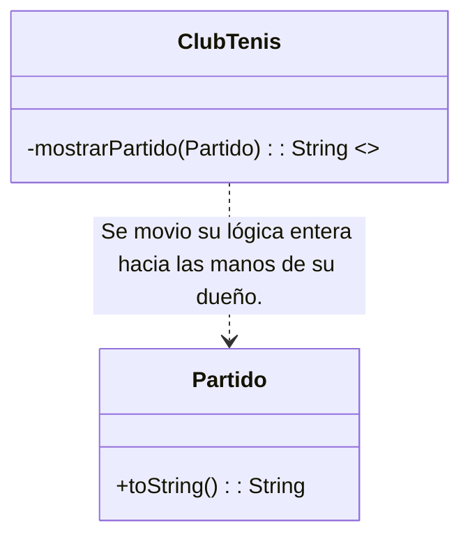

# Clase 2: Catálogo y Herramientas formales de Refactoring

## 🎩 La Metáfora de los "Dos Sombreros" (Kent Beck)
Esta popular idea en ingeniería de software hace énfasis en que solo podemos tener puesto **un rol/sombrero a la vez** y hay que intercalarlos conscientemente sin mezclarlos:
1.  **Sombrero de Agregar Funcionalidad:** Pensamos concretamente en atacar el nuevo requerimiento de negocio. Agregamos código útil y escribimos los tests para que validen este mismo requerimiento.
2.  **Sombrero de Refactorización:** **Únicamente realizable bajo la garantía absoluta de que los tests están todos "En Verde".** No implementamos *features* ni agregamos nada nuevo. Solo invertimos tiempo en reorganizar lo sucio.

## ⚙️ Automatización (El Árbol AST y las Tools)
Hacer un refactoring manual cortando y pegando hilos a ojo es peligroso además y propenso a errores. Las herramientas modernas integradas (e.g. IDEs modernas) lo automatizan.
*   Comprueban todas las precondiciones estáticamente sin necesidad de tocar un carácter e implementan su reescritura segura de nodos basándose exhaustivamente en recorrer el **AST (Abstract Syntax Tree)** y procesar variables de entorno usando la **Tabla de Símbolos** del programa intermedio.

---

## 🛠️ Catálogo de Refactorings (Mecánicas y Ejemplos Prácticos)

### 1. Extract Method
**Motivación:** Descomponer un "Método Largo" o "Altamente Comentado" para recuperar orden, separar lógicas independientes y reusar operaciones sin estorbar la lectura analítica inicial.

*   **Mecánica Básica:**
    1.  Crear y declarar al método nuevo poniéndole un nombre muy expresivo.
    2.  Copiar al portapapeles y pegar el bloque original que sobraba.
    3.  Repasar exhaustivamente sus interacciones del *scope* viejo y readecuar las variables locales correspondientes (pasarlas imperativamente como parámetro, o si mutan fuertemente su estado hacer que el cambio sea el valor de un retorno devuelto).
    4.  Reemplazar pasivamente el chorizo largo de código original con únicamente el puntero o nombre de método. ¡Testear!.

**Ejemplo - Método original gigantesco:**
```java
// ClubTenis (Mal olor)
public String mostrarPuntajesJugadoresEnFecha(LocalDate fecha) {
  for (Partido p : partidosFecha) {
    // INICIO DEL ENORME BLOQUE REPETITIVO PARA J1 Y J2 //
    Jugador j1 = p.jugador1();
    result += "Puntaje del jugador: " + j1.nombre();
    // [...] Multiples calculos sueltos, for loops 
    // y asignaciones para calcular los games aca... 
  }
}
```
**Refactorizado (Con la porción aislada vía Extract Method):**
```java
public String mostrarPuntajesJugadoresEnFecha(LocalDate fecha) {
  for (Partido p : partidosFecha) {
     result += this.mostrarPartido(p); // <-- ¡La Extracción! Menos carga cognitiva.
  }
}
private String mostrarPartido(Partido partido) { 
   // La lógica engorrosa fue limpiamente movida y encapsulada aquí abajo
}
```

### 2. Move Method (Mover Método)
**Motivación:** Combatir la *Envidia de Atributo* (`Feature Envy`). Ocurre cuando un método (por ejemplo en el code snippet antes visto: `mostrarPartido` dentro de `ClubTenis`) se pasa la vida llamándole cosas internas al `Partido`. La clase ajena tiene la verdadera relevancia para esa tarea.

*   **Mecánica:** Declarar la carcasa del método en la clase deseada (La víctima del feature-envy). Copiar la lógica y ajustar adaptadores. Cambiar la implementación original de quien llamaba dejándola obligada como simple invocador delegador pasivo (o borrarla directamente de un plumazo si no hace más falta). Resultando aquí también un posible **Rename Method** en simultáneo (pasando a llamarse `toString()`).

**Evolución Estructural del Dominio usando `Mermaid`:**


### 3. Replace Temp with Query
**Motivación:** Ayuda a prevenir métodos largos inmensos y facilita enormemente posteriores usos del _Extract Method_. Su principal cometido es purgar de memoria viejas rutinas de cálculo que son "congeladas" en el valor de retorno de una variable temporal sin provecho exterior.

*   **Solución:** Extraemos tajantemente toda la expresión/matemática productora a un método nuevo de consulta sin side-effects (*Query* puro) y de paso reemplazamos unánimemente TODAS las referencias directas a la "v.i." vieja inyectando la nueva función de manera viva en su lugar (Permitiendo reutilizar este motor para partes de lógica externas que a futuro lo quieran usar).

### 4. Replace Conditional with Polymorphism
**Motivación:** Aliviar el clásico dolor estomacal causado por gigantescos y sucios `Switch` u `If/else if` consecutivos en cadena donde explícitamente se romántiza sobre tipos u orígenes (e.g., alterar manual el cálculo crudo de puntajes extra para tenistas priorizando si son Zona A, B o C en medio del método).

*   **Mecánica Base:** 
    *   Sistematizar construyendo formalmente la jerarquía (Super y sus sub-objetos). 
    *   Viajando y bajando hacia cada subclase nueva individual, crear un método gemelo que sobreescriba adrede a este infame.
    *   Hacer *Cut y Paste* aislando el bloquecito estricto que yacía atrapado vivo bajo la respectiva llave de aquel if.
    *   Destruir los bloques `If` y hacer que la interfaz madre original y la función madre se auto destronen transformándose en `Abstract`. Delegando y esparciendo transparentemente de esta manera sobre un Polimorfismo vivo todo este tema.

**ANTES DEL REFACTORING (Estructura podrida procedural):**
```java
// Mal, rompiendo abstracciones...
if (this.zona() == "A") result += (total * 2);
if (this.zona() == "B") result += total;
```
**RESOLUCIÓN MEDIANTE POLIMORFISMO:**
```java
// Un pedazo independiente en JugadorZonaA.java  (Una Subclase formal ahora)
@Override
public int puntosGanadosEnPartido(Partido p) {
  // Aprovecha y también acusa el uso utilitario del viejo Extract Method/ReplaceTemp :)
  return this.totalGamesEnPartido(p) * 2;
}

// Otro pedazo paralelo en JugadorZonaB.java
@Override
public int puntosGanadosEnPartido(Partido p) {
  return this.totalGamesEnPartido(p);
}
```
