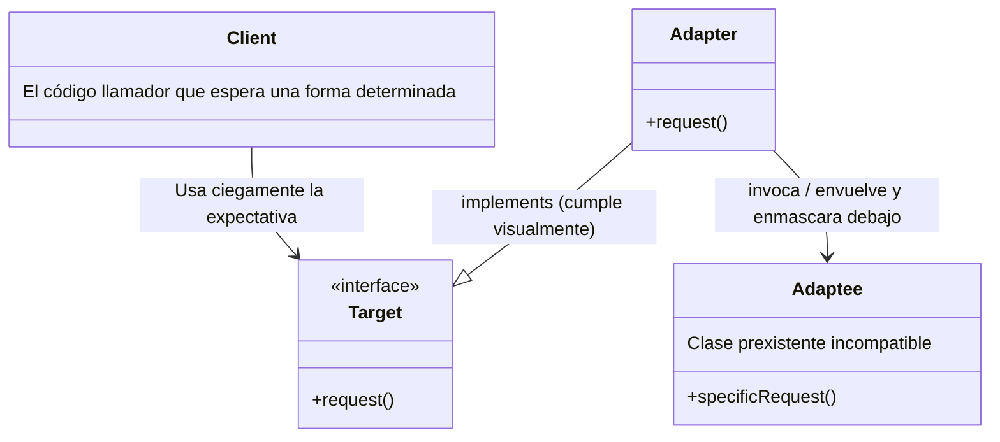
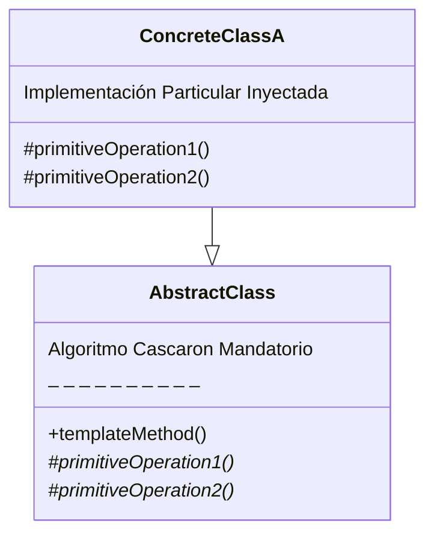

# Clase 3: Introducción a los Patrones de Diseño

El diseño de arquitecturas es abismal y complejo incluso con un puñado de objetos simples. A lo largo del tiempo, distintos programadores recurrentemente sufrieron trabas y problemas comunes, lo cual permitió abstraer lecciones valiosas.

## 🗣️ ¿Qué es verdaderamente un Patrón de Diseño?
Originalmente propuestos lejos del desarrollo, el arquitecto *Christopher Alexander* los usó en 1977 para el lenguaje de la arquitectura edilicia. Fue recién tras las décadas del '90 cuando el célebre **GoF (Gang of Four - Erich Gamma y co.)** destripó e introdujo permanentemente el formato oficial a objetos en el libro "*Design Patterns*".

> **Definición Clave:** Un patrón describe un núcleo y base abstracta y limpia (una solución genérica) a un problema persistente, pesado y recurre de índole lógica o estructural dentro de un contexto particular; de manera empírica tal que uno pueda clonar teóricamente esa misma morfología de solución repetidas veces adaptándolo a su escenario cotidiano sin llegar jamás a rehacer idénticamente las minucias a cero. 

---

## 🔌 Patrón Structural: ADAPTER (Adaptador o *Wrapper*)
*   **Intención Principal:** Su tarea es de fuerza de traducción. Su principal meta es "Convertir" o forzar una interfaz ya existente de una clase (Generalmente cerrada, fea, u originaria de una librería blindada por un *vendor* exógeno del que no somos dueños) artificialmente en otra interfaz que sea **exactamente lo que nuestros clientes o jerarquía principal esperan de origen entender**.
*   **Logro:** Enchufar y enlazar clases totalmente incompatibles haciéndolas correr fluidamente.

**Estructura y Anatomía base del Adapter:**


**Ejemplo Práctico en el PDF Original: (IoT Sensores y Notificación Telegram)**
El sistema espera por su lógica de eventos original que toda entidad que se intente suscribir formalmente a escuchar ante un `Sensor` obligatoriamente extienda/herede de `Actuador` y que, religiosamente, entienda e implante dentro suyo un método `update(Sensor)`.
Pero ahora surge un conflicto: necesitamos sumar la biblioteca importada `TelegramNotifier` que funciona maravillosamente enviando mensajes con su propio mandato particular  `sendNotification(id, text)`. Como no somos creadores de esta librería ni podemos alterar su clase nativa obligándola forzosamente a extender y firmar nuestra Interface propia de actuador y que empiece a regirse ante un `update()` caprichoso... la envolvemos para que cuadre perfectita: En un **Adapter**.

```java
// Este Adapter "engaña" a nuestro Sensor.
public class TelegramAdapter extends Actuador {
  private TelegramNotifier asistentForeignLibrary; 
  
  // Implanta pasivamente el formato exigido Target
  @Override
  public void update(Sensor sensor) {
    // Tras bambalinas asimila los pedazos y efectua una traducción 
    // a algo que solo la biblioteca gringa incompatible va a asimilar
    String mensajecito = "Alerta: Cambio en el ambiente a " + sensor.getValor();
    asistentForeignLibrary.sendNotification("CHAT_GRUPO_DOMOTICO_1", mensajecito);
  }
}
```

---

## 🖼️ Patrón de Comportamiento: TEMPLATE METHOD
*   **Intención Principal:** "Plantilla de flujo". El modelo de este patrón fuerza a dictaminar unilateralmente desde una cima abstracta el "esqueleto maestro estructural" general y la línea de transcurso temporal que debe seguir todo el orden y fluir de un algoritmo. Su finalidad es deferir (dejar deliberadamente agujereados) los pasos crudos e implementatorios a manos de sus subclases de manera que **las mismas no tengan chance bajo ningún punto de vista de subvertir ni alterar la coreografía inicial generalizada**.

**Estructura Base del Template Method:**


**Ejemplo Práctico en el PDF Original: (El Exportador de Archivos CSV y PDF)**
Bajo escenarios inmaduros, un programador creando objetos Exportadores a PDF y Formatos tabulares por separado terminaría duplicando groseramente el código "mecánico" perimetral calcado de ambos tales como: *"Abrir y cerrar descriptores de archivos de sistema"*, imprimir *"Preparando Metadatos... cerrando I/O... Guardando al disco."*, sin poder separarlos de la singular y estricta forma de volcar y codear binariamente el flujo diferencial de un renglón PDF text markup versus lo particular de separar comas simples en formato de un renglón estándar CSV.

**Armado de la Solución (Con *Template Method*):**
```java
public abstract class ReportExporter {
  
  // 1: EL TEMPLATE METHOD MAESTRO EN CUESTIÓN.
  // Su keyword FINAL prohíbe pisoteos estructurales de los rebeldes hijos a futuro!
  public final void export(ReportData data, String filePath) {
    prepareData();       // Func. Compartida
    openFile(filePath);  // Func. Compartida
    
    writeHeader();         // <--- Operación Primitiva Diferida a manos Especiales
    writeData(data);       // <--- Operación Primitiva Diferida 
    
    closeFile();         // Func. Compartida Común 
  }

  // 2: Las subclases por culpa del abstracto DEBEN responder si o si a su formato particular:
  protected abstract void writeHeader();
  protected abstract void writeData(ReportData data);
}
```
*   **Efecto Clave Subyacente:** Produce una colosal **Inversión de Control ("El Principio de Hollywood")** . En lugar de que la torpe clase hija cliente llame a una biblioteca rutinaria y superior para pedir socorro explícitamente a cada momento que deba imprimir, se genera que la rígida entidad y arquitectura matriz englobadora la llama directamente, subordinándola (*"No nos llames, nosotros te llamamos cuando tu hora haya llegado"*).
