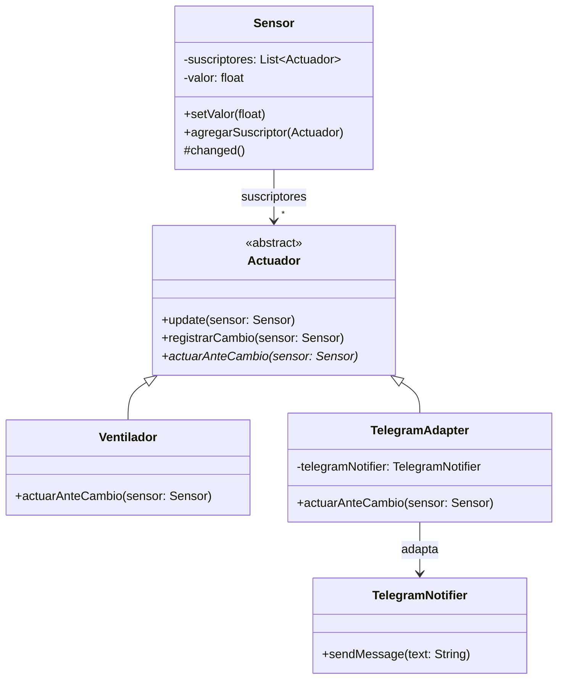
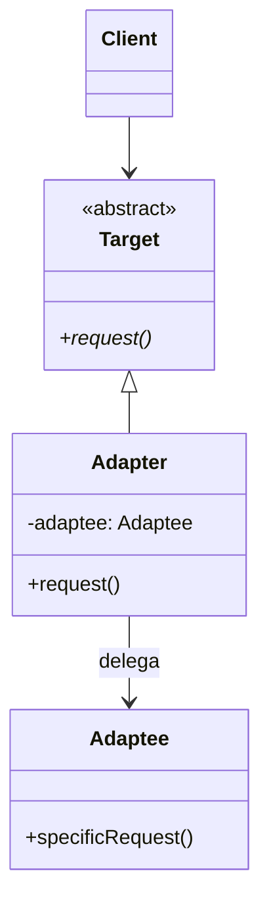
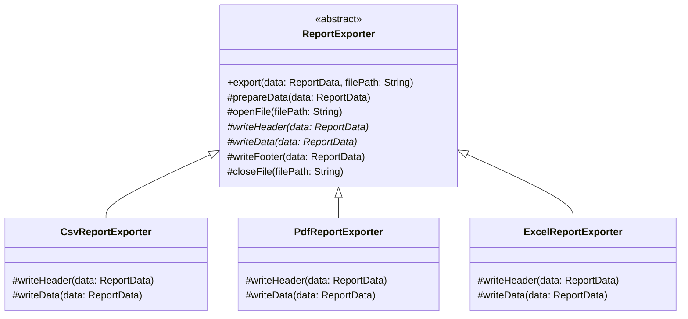
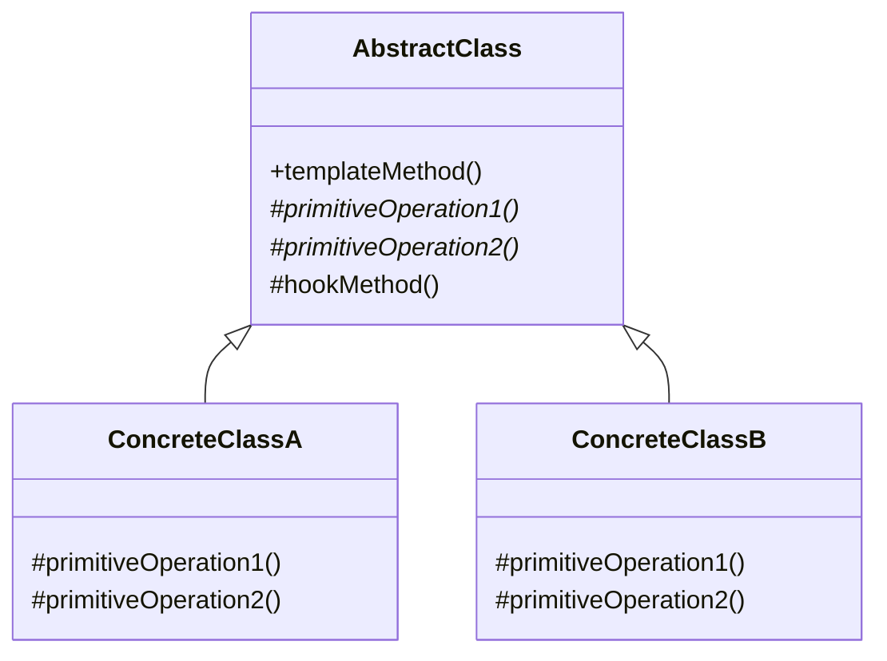

# 📘 Clase 3: Introducción a Patrones de Diseño — Adapter & Template Method

**Materia:** Orientación a Objetos 2 (OO2) — UNLP 2026  
**Docente:** Dra. Alejandra Garrido  
**Temas:** Origen de los patrones, el catálogo GoF, patrón Adapter (Estructural) y patrón Template Method (Comportamiento).

---

# Parte A: Introducción a los Patrones de Diseño

## 🏛️ ¿De dónde vienen los Patrones?

### El origen: Christopher Alexander (Arquitectura)

Los patrones de diseño de software nacieron como una adaptación del trabajo del arquitecto **Christopher Alexander**, quien los usaba en arquitectura de espacios físicos.

> *"Each pattern describes a problem which occurs over and over again in our environment, and then describes the core of the solution to that problem, in such a way that you can use this solution a million times over, without ever doing it the same way twice."*  
> — Alexander et al. 1977

### Ejemplo de Alexander: "Luz en dos lados de cada habitación"
- **Problema:** ¿Cómo diseñar las paredes de cada habitación?
- **Observación:** Las personas evitan las habitaciones con luz de un solo lado.
- **Solución:** Ubicar cada habitación con espacio exterior en al menos dos lados y colocar ventanas en esas paredes.

> La solución no dice "poné dos ventanas en la pared norte y sur". Es **suficientemente genérica** para poder aplicarse de diferentes maneras.

---

### De la arquitectura al software...

**Ward Cunningham** y **Kent Beck** (OOPSLA '87) fueron los primeros en proponer el uso de lenguajes de patrones para programas orientados a objetos.

Un patrón de software es un **par problema-solución** que:
- Trata con **problemas recurrentes** y buenas soluciones probadas.
- La solución es **suficientemente genérica** para poder aplicarse de diferentes maneras.

---

## 📖 El Catálogo GoF (Gang of Four)

**Gamma, Helms, Johnson, Vlissides:**  
*"Design Patterns: Elements of Reusable Object-Oriented Software"* (1994)

Cada patrón del catálogo describe una **solución simple y elegante** a un problema específico en el diseño OO, que fue desarrollada y evolucionada en el tiempo, después de rediseñar, fallar y reflexionar.

### Partes de la descripción de un patrón (GoF)

| Sección | Descripción |
|---|---|
| **Nombre** | (y otros nombres por los que puede conocerse) |
| **Intención** | Qué problema resuelve concisamente |
| **Motivación** | Un escenario concreto que ilustra el problema |
| **Aplicabilidad** | Cuándo usar el patrón |
| **Estructura** | Diagrama de clases con los roles |
| **Participantes** | Responsabilidad de cada rol |
| **Colaboraciones** | Cómo interactúan los participantes |
| **Consecuencias** | Pros y contras |
| **Implementación** | Variantes y consideraciones |
| **Código** | Ejemplo (C++ en el original) |
| **Usos Conocidos** | Dónde se usó en sistemas reales |
| **Patrones Relacionados** | Otros patrones que se complementan |

### 🧠 ¿Qué es importante estudiar y recordar?

1. **Propósito** (intención).
2. **Estructura:** Clases que componen el patrón (roles), cómo se relacionan (jerarquías, clases abstractas/interfaces, métodos abstractos, composición).
3. **Variantes de implementación.**
4. **Consecuencias** positivas y negativas.
5. **Relación con otros patrones.**

---
---

# Parte B: Patrón Adapter (Estructural)

## 🎯 Propósito

> **"Convertir" la interfaz de una clase en otra que el cliente espera.** Adapter permite que ciertas clases con interfaces **incompatibles** puedan trabajar en conjunto.

**Aplicabilidad:** Usar Adapter cuando querés usar una clase existente y su interfaz **no es compatible** con lo que necesitás.

En criollo: tenés un enchufe de 3 patas y la pared tiene 2 agujeros. El Adapter es el intermediario que "traduce" las patas para que se conecten.

---

## 📦 Ejemplo del PDF: Sensores y Actuadores (IoT)

### Situación Inicial

Un sistema IoT donde los actuadores se suscriben a los cambios de un sensor:

```java
public class Sensor {
    private List<Actuador> suscriptores = new ArrayList<>();
    private float valor;

    public void setValor(float unValor) {
        valor = unValor;
        this.changed();
    }

    protected void changed() {
        suscriptores.stream().forEach(sus -> sus.update(this));
    }

    public void agregarSuscriptor(Actuador actuador) { ... }
}

abstract class Actuador {
    public void update(Sensor sensor) {
        this.registrarCambio(sensor);
        this.actuarAnteCambio(sensor);
    }
}

class Ventilador extends Actuador {
    public void actuarAnteCambio(Sensor sensor) {
        if (sensor.getValor() > 18.5) {
            this.encenderVentilador();
        } else {
            this.apagarVentilador();
        }
    }
}
```

### El Problema

Queremos agregar un nuevo actuador que envíe un mensaje por **Telegram** usando una clase `TelegramNotifier` de una librería externa que **no puede cambiarse** (ni su código, ni su jerarquía, ni las interfaces que implementa).

- `Sensor` solo permite objetos `Actuador` como suscriptores.
- `Sensor` envía el mensaje `update(sensor)` a ellos.
- Pero `TelegramNotifier` **no es un Actuador** ni entiende `update()`.

### La Solución: Patrón Adapter

Crear una clase que actúe como puente entre ambas interfaces:



`TelegramAdapter` hereda de `Actuador` (para que `Sensor` lo acepte) y delega el trabajo real a `TelegramNotifier` traduciéndole los parámetros.

---

## 🏗️ Estructura Genérica del Patrón



## 👥 Participantes

| Participante | Responsabilidad |
|---|---|
| **Target** | Define la interfaz específica que usa el cliente. |
| **Client** | Colabora con objetos que satisfacen la interfaz de Target. |
| **Adaptee** | Define una interfaz existente que **necesita ser adaptada**. |
| **Adapter** | Adapta la interfaz del Adaptee a la interfaz del Target. |

---

## ✅ Consecuencias

| | Descripción |
|---|---|
| ✅ | Una misma clase Adapter puede usarse para **muchos Adaptees** (el Adaptee y todas sus subclases). |
| ✅ | El Adapter puede **agregar funcionalidad** a los adaptados. |
| ❌ | Se generan **más objetos intermediarios**. |

### Variantes de implementación:
- **Pluggable adapters** (adaptadores enchufables).
- **Parameterized adapters** (adaptadores parametrizados).

---
---

# Parte C: Patrón Template Method (Comportamiento)

## 🎯 Propósito

> **Definir el esqueleto de un algoritmo en un método, difiriendo algunos pasos a las subclases.**  
> Template Method permite que las subclases **redefinan ciertos pasos** de un algoritmo **sin cambiar la estructura** del algoritmo.

**Aplicabilidad:** Usar Template Method:
- Para implementar las partes **invariantes** de un algoritmo una vez y dejar que las subclases implementen los aspectos que varían.
- Para **evitar duplicación de código** entre subclases.
- Para **controlar las extensiones** que pueden hacer las subclases.

En criollo: definís la "receta" en la clase padre (los pasos y su orden), pero dejás que cada hijo complete los pasos específicos a su manera.

---

## 📦 Ejemplo del PDF: Exportadores de Reportes

### Situación Inicial (Código Naive — Sin patrón)

Cada exportador (CSV, PDF) repite la misma secuencia de pasos:

```java
class CsvReportExporterNaive {
    public void export(ReportData data, String filePath) {
        // 1. Preparing data (common)
        // 2. Opening file (common)
        // 3. Writing CSV header (specific)
        // 4. Writing CSV data rows (specific)
        // 5. Writing CSV footer (common)
        // 6. Closing file (common)
    }
}

class PdfReportExporterNaive {
    public void export(ReportData data, String filePath) {
        // 1. Preparing data (common)    ← DUPLICADO
        // 2. Opening file (common)      ← DUPLICADO
        // 3. Writing PDF header (specific)
        // 4. Writing PDF data rows (specific)
        // 5. Writing PDF footer (common) ← DUPLICADO
        // 6. Closing file (common)      ← DUPLICADO
    }
}
```

### Problemas:
- **Duplicación de código** en los pasos comunes.
- Si hay que agregar un **paso nuevo común**, seguimos duplicando.
- Propenso a **errores** al agregar nuevas subclases que no respeten el orden de los pasos.

---

### La Solución: Aplicar Template Method



El método `export()` es el **Template Method**: define el esqueleto del algoritmo y llama a los pasos en el orden correcto. Los pasos marcados con `*` son **abstractos** y los implementan las subclases.

---

## 🏗️ Estructura Genérica del Patrón



## 👥 Participantes

| Participante | Responsabilidad |
|---|---|
| **AbstractClass** | Implementa el **template method** (el esqueleto del algoritmo). Declara las **operaciones primitivas abstractas** que las subclases deben definir. |
| **ConcreteClass** | Implementa las operaciones primitivas que llevan a cabo los **pasos específicos** del algoritmo. |

---

## ✅ Consecuencias y Colaboraciones

| | Descripción |
|---|---|
| ✅ | Técnica fundamental de **reuso de código**. |
| ✅ | Lleva a tener **inversión de control**: la superclase llama a operaciones definidas en las subclases (Hollywood Principle: "Don't call us, we'll call you"). |
| ✅ | Controla qué extensiones pueden hacer las subclases: solo pueden variar los pasos definidos como abstractos/hooks. |

### Tipos de operaciones que llama el Template Method

| Tipo | Descripción |
|---|---|
| **Operaciones Primitivas** | Son **abstractas** en la AbstractClass. Las subclases **tienen que** definirlas obligatoriamente. |
| **Hook Methods** | Son **concretas** en la AbstractClass (con implementación default o vacía). Las subclases **pueden** redefinirlas si lo necesitan. |

### Consideración de Implementación:
> **Minimizar la cantidad de operaciones primitivas** que las subclases deben redefinir. Cuantas menos operaciones haya que redefinir, más simple es agregar una nueva subclase.

---

## 🔗 Template Method en el Ejemplo de Actuadores

El PDF muestra que el patrón Template Method **ya estaba presente** en el ejemplo de Sensores/Actuadores de la Parte B:

```java
abstract class Actuador {
    // TEMPLATE METHOD:
    public void update(Sensor sensor) {
        this.registrarCambio(sensor);       // Paso común (concreto)
        this.actuarAnteCambio(sensor);      // Paso variable (primitivo/abstracto)
    }
}

class Ventilador extends Actuador {
    // OPERACIÓN PRIMITIVA:
    public void actuarAnteCambio(Sensor sensor) {
        if (sensor.getValor() > 18.5) {
            this.encenderVentilador();
        } else {
            this.apagarVentilador();
        }
    }
}
```

> `update()` es el Template Method que define el esqueleto (registrar + actuar). `actuarAnteCambio()` es la operación primitiva que cada subclase concreta define. Esto demuestra que **los patrones muchas veces aparecen combinados** en un mismo diseño (acá: Adapter + Template Method).

---

## 📚 Recursos y Referencias del PDF

- **GoF:** *"Design Patterns: Elements of Reusable Object-Oriented Software"* — Gamma, Helms, Johnson, Vlissides.
- **Ward Cunningham:** *"The Starting Point of Software Patterns"* — [YouTube](https://www.youtube.com/watch?v=_V0kVOLOCrY)
- **Christopher Alexander:** Keynote en OOPSLA'96 — [YouTube](https://www.youtube.com/watch?v=98LdFA-_zfA)
- **Scrum Patterns:** [scrumbook.org](https://scrumbook.org/)
- **PLoP Conferences:** [plopcon.org](https://plopcon.org/)
- **The Hillside Group:** [hillside.net](https://hillside.net/)
