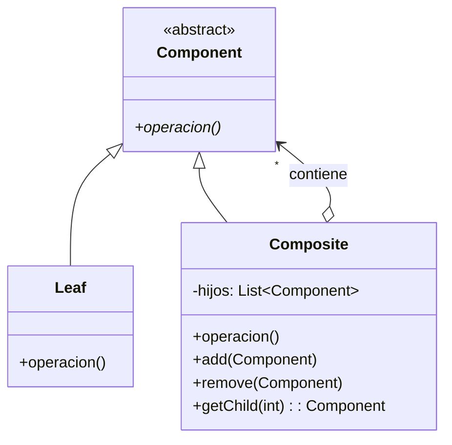
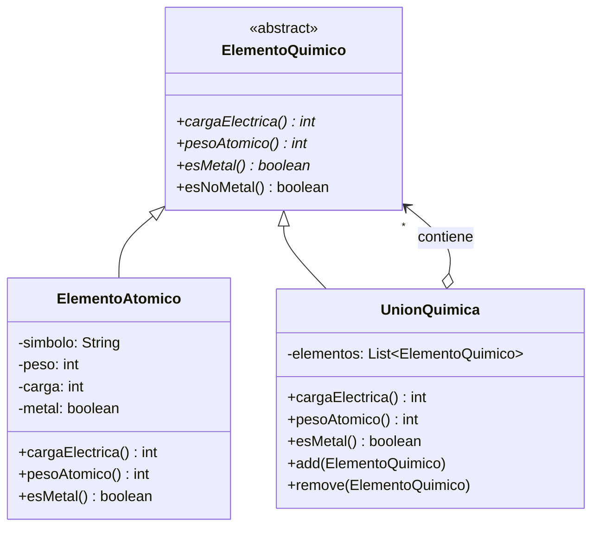
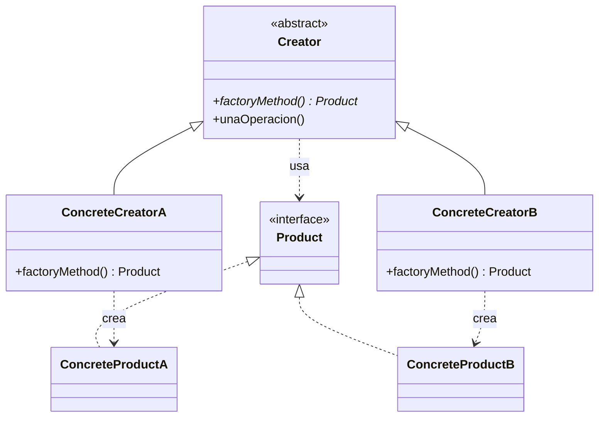
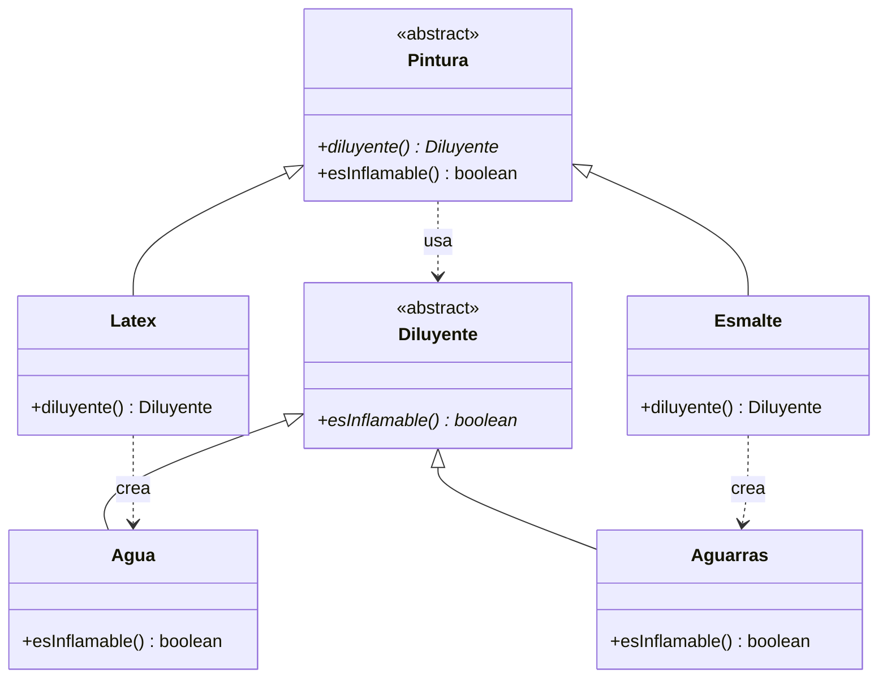
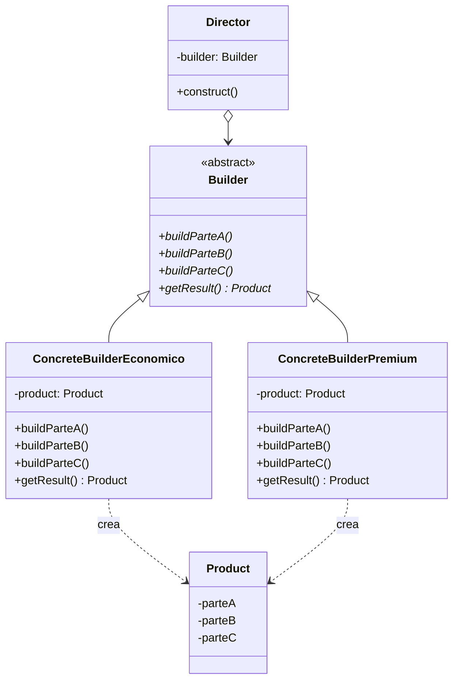

# 📘 Clase 4: Composite, Factory Method & Builder

**Materia:** Orientación a Objetos 2 (OO2) — UNLP 2026  
**Docente:** Federico Balaguer  
**Categorías de Patrones:** Estructural (Composite) + Creacionales (Factory Method, Builder)

---

# Parte A: Patrón Composite (Estructural)

## 🎯 Propósito

> **Componer objetos en estructuras de árbol para representar jerarquías parte-todo.**  
> El Composite permite que los clientes traten a los objetos atómicos (hojas) y a sus composiciones (nodos) **de forma uniforme** (polimorfismo).

En criollo: es la idea de que un "grupo de cosas" se comporta exactamente igual que una "cosa sola".

---

## 📦 Ejemplo Motivador 1: Productos y Bundles (Combos)

Imaginemos productos de un e-commerce:

| Ejemplo | Código Producto | Precio |
|---|---|---|
| 1 Talco | `== Talco` | Precio unitario |
| Array de 4 Talcos (Bundle) | `!= Talco` | Precio promo |
| Kit con Bundles adentro (Bundle) | `!= Talco != Bundle` | Precio Kit |

Un **Bundle** es una agrupación de productos, y un Bundle puede contener otros Bundles. El cliente final solo pregunta `precio()` sin importar si es un producto simple o un combo gigante anidado. Eso es Composite.

---

## 📦 Ejemplo Motivador 2: Préstamos con Garantías Prendarias

- Un **Préstamo** tiene un adelanto de dinero (capital) que se devuelve con intereses.
- La **Garantía** es un bien (vehículo, joya, sueldo, factura futura) que se ejecuta si el deudor no paga.
- Regla fundamental: `Garantía.valorPercibido >= Prestamo.capital`

### ¿Cómo tener multi-garantías?

**Opción mala:** Poner una colección de garantías directamente en `Prestamo`.
- ❌ Mayor complejidad en Prestamo.
- ❌ Diferentes fechas de validez y maturity.

**Opción buena (Composite):** Crear una `GarantíaMixta` **que también sea una Garantía**.
- ✅ Contiene internamente una colección de Garantías.
- ✅ Es **transparente** para el `Prestamo` (sigue viendo una sola garantía).
- ✅ Soporta ABM de sub-garantías.

---

## 🏗️ Estructura del Patrón



## 👥 Participantes (Roles)

| Participante | Responsabilidad |
|---|---|
| **Component** | Declara la interfaz común (abstracta) para hojas y compuestos. Define el comportamiento default. |
| **Leaf (Hoja)** | No tiene sub-árboles. Define el comportamiento de los objetos primitivos/atómicos. |
| **Composite** | Define el comportamiento para componentes complejos. Implementa `add()`, `remove()` y delega `operacion()` recorriendo sus hijos. |

---

## ✅ Consecuencias (Pros y Contras)

| | Descripción |
|---|---|
| ✅ | Define **jerarquías** de objetos primitivos y compuestos. |
| ✅ | Los primitivos pueden componerse en complejos, y estos a su vez **recursivamente**. |
| ✅ | **Simplifica los clientes.** Los clientes no saben (ni deberían) si manejan un compuesto o un simple. |
| ✅ | Facilita el **agregado de nuevos tipos** de componentes sin modificar los clientes. |
| ❌ | Debe ser "customizado" con **reglas de composición** si fuera necesario. |

---

## ⚙️ Cuestiones de Implementación

- ¿Referencias explícitas a la raíz desde una hoja?
- Maximizar el protocolo de la clase/interfaz `Component`.
- ¿Importa el orden de las hojas?
- Borrado de componentes.
- Búsqueda de componentes (fetch) por criterios.
- ¿Qué estructura de datos usar para guardar los hijos? (List, Set, Map...)

---

## 📦 Ejemplo Concreto: Elementos Químicos

Se modelan elementos de la tabla periódica usando Composite:

| Símbolo | Peso | Carga | Clasificación |
|---|---|---|---|
| H | 1 | +1 | No metal |
| O | 16 | -2 | No metal |
| Cl | 35 | -1 | No metal |
| Na | 23 | +1 | Metal |
| Ca | 40 | +2 | Metal |

### Reglas de Composición (¡Fundamental!)

| Combinación | ¿Permitido? |
|---|---|
| Metal + No metal | ✅ |
| No metal + No metal | ✅ |
| Metal + Metal | ❌ |

**Ejemplos:**
- ❌ Na + Ca → inválido (Metal + Metal)
- ✅ Na + Cl → NaCl (Sal de mesa)
- ✅ Ca + O → CaO
- ✅ H + O → H₂O (Agua)

### Comportamiento de la Unión (Composite)

- **Carga total** = suma de las cargas de sus componentes.
  - Si carga total == 0 → **Molécula**
  - Si carga total != 0 → **Ión**
- **Peso molecular** = suma de los pesos de sus componentes.



> **Nota importante:** `esNoMetal()` se implementa como `return !this.esMetal()` en la superclase. No hace falta que sea abstracto.

### 🧠 Preguntas de Repaso (del PDF)

1. **¿Cómo implementar `cargaElectrica()` y `pesoAtomico()` en `UnionQuimica`?**
   - Recorrer la colección `elementos` y **sumar** los valores de cada componente (delegación polimórfica).

2. **¿`esMolecular()` y `esIon()` deben ser abstractos?**
   - No necesariamente. Se pueden tener con **implementación concreta en la superclase**: `esMolecular()` → `cargaElectrica() == 0` y `esIon()` → `!esMolecular()`.

3. **¿Dónde poner `add()` y `remove()` para crear configuraciones?**
   - En `UnionQuimica` (el Composite), no en la superclase. Solo el nodo compuesto sabe agregar/eliminar sub-elementos.

---

## 🌍 Otros Usos Comunes del Composite

- **Group/Ungroup** de elementos gráficos (editores como Figma/PowerPoint).
- **Carpetas, archivos y links simbólicos** (sistemas de archivos).
- **Combos** (cajita feliz, útiles escolares, packs de productos).
- **Productos financieros** (préstamos hipotecarios con colaterales).
- **Pixels/Celdas** en sensado remoto (imágenes satelitales).
- **Paquetes de alojamiento** turístico.

---
---

# Parte B: Patrón Factory Method (Creacional)

## 🎯 Propósito

> **Define una interfaz para la creación de objetos, dejando que las subclases decidan qué clase instanciar.**  
> Separa la instanciación/configuración de un objeto "Producto" en un método que puede ser extendido por subclases del "Creador".

**Alias:** Virtual Constructor.

En criollo: en vez de hacer un `new ConcreteProduct()` directamente en la clase padre, definís un método abstracto `crearProducto()` y cada subclase decide qué objeto concreto devolver.

---

## 🏗️ Estructura del Patrón



## 👥 Participantes (Roles)

| Participante | Responsabilidad |
|---|---|
| **Product** | Define la interfaz de los objetos creados por el factory method. |
| **ConcreteProduct** | Implementa la interfaz del Product. |
| **Creator** | Declara el factory method (abstracto o con comportamiento default). |
| **ConcreteCreator** | Implementa el factory method retornando una instancia concreta. |

---

## 📦 Ejemplo Concreto: Mezclador de Pinturas

Una empresa constructora necesita un programa para diseñar pinturas considerando:
- Colores en stock
- Tipo de pintura (superficie, tiempo de secado, repintado)
- Superficie a cubrir → Costo
- **Requerimiento de transporte: ¿inflamable o no?** (depende del diluyente)

### Tipos de Pinturas y Diluyentes

| Pintura | Diluyente |
|---|---|
| Látex | Agua |
| Acrílico | Agua |
| Esmalte | Aguarrás |
| Laca | Thinner |
| Epoxi | Xileno |

### ¿Dónde entra Factory Method?

- El método `esInflamable()` depende del **diluyente** que usa cada pintura.
- No es buena idea tenerlo *hard-coded* en cada subclase.
- Cada subclase de `Pintura` implementa un **factory method** llamado `diluyente()` que retorna el diluyente concreto correspondiente.
- La superclase `Pintura` define `esInflamable()` invocando `this.diluyente().esInflamable()`.



> **Nota del PDF:** `Acrílico` y `Látex` comparten el mismo diluyente (Agua), lo que genera código repetido. Eso **no invalida** el patrón, es una cuestión del dominio que se puede resolver con Refactorings.

---

## 📦 Factory Method "Unleashed": La Tabla Periódica

### El Problema
Las clases hoja del Composite (`Oxigeno`, `Hidrogeno`, `Cloro`, etc.) tienen las **mismas variables y getters** → código duplicado masivo (hay 118 elementos atómicos).

### La Solución
En vez de tener una subclase para cada átomo, se usa **una única clase `ElementoAtomico`** y se delega la responsabilidad de *configurar* cada elemento a una clase `TablaPeriodica` con **factory methods**:

```java
// Ejemplo conceptual:
public class TablaPeriodica {
    public ElementoAtomico crearOxigeno() {
        return new ElementoAtomico("O", 16, -2, false);
    }
    public ElementoAtomico crearHidrogeno() {
        return new ElementoAtomico("H", 1, +1, false);
    }
    public ElementoAtomico crearSodio() {
        return new ElementoAtomico("Na", 23, +1, true);
    }
    // ... etc para los 118 elementos
}
```

### Factory Method en una cáscara de nuez

- Codifica la lógica de instanciación/configuración en **un único lugar**.
- Nació como forma de mitigar problemas de instanciación con **jerarquías paralelas**.
- Poner **nombre** a objetos complejos con reglas fijas: `Agua`, `AguaOxigenada`, `SalDeMesa`...
- Ejemplos del mundo real: Combo BigMac, Whopper, CeroVeggie...

---
---

# Parte C: Patrón Builder (Creacional)

## 🎯 Propósito

> **Separa la construcción de un objeto complejo de su representación,**  
> de tal manera que el **mismo proceso de construcción** puede crear **diferentes representaciones**.

En criollo: tenés una "receta" fija (pasos a seguir), pero los "ingredientes" cambian según el caso. El Director sigue la receta, y el Builder provee los ingredientes concretos.

---

## 🏗️ Estructura del Patrón



## 👥 Participantes (Roles)

| Participante | Responsabilidad |
|---|---|
| **Builder** | Especifica una **interfaz abstracta** para crear las partes de un Producto. |
| **ConcreteBuilder** | Construye y ensambla las partes. **Guarda referencia al producto en construcción.** |
| **Director** | Conoce los **pasos** para construir el objeto. Utiliza al Builder para construir cada parte. |
| **Product** | Es el objeto complejo a ser construido. |

---

## 📦 Ejemplo Concreto: Viajes de Egresados

Un viaje de egresados se compone de:
- ❖ Transporte
- ❖ Alojamiento con comidas
- ❖ Asistencia Médica
- ❖ Coordinación (profes y guardavidas)
- ❖ Fiesta
- ❖ Excursiones

### El esquema general siempre es el mismo (la "receta")
Pero las agencias ofrecen **diferentes alternativas** para cada servicio:
- 💰 **Económico** (bus, hostel, DJ básico...)
- 💎 **Premium** (aéreo, resort all-inclusive, banda en vivo...)

### ¿Por qué Builder y no herencia directa?

No sería buen diseño tener servicios "duplicados" según sean Premium o Económico. La **estructura del viaje se repite** (siempre tiene transporte, alojo, fiesta, etc.), pero las **partes concretas cambian**.

### Diagrama de Secuencia (Cómo funciona)

```
Cliente → Director: construct()
    Director → Builder: buildTransporte()
    Director → Builder: buildAlojamiento()
    Director → Builder: buildAsistenciaMedica()
    Director → Builder: buildCoordinacion()
    Director → Builder: buildFiesta()
    Director → Builder: buildExcursiones()
Cliente → Builder: getResult() → Viaje
```

---

## ✅ ¿Vale la pena usar Builder?

| Sí vale la pena cuando... | No vale la pena cuando... |
|---|---|
| Querés abstraer la construcción compleja | Requiere diseñar e implementar varios roles |
| Necesitás **variar** lo que se construye (intercambiar Director ↔ Builder) | Cada tipo de producto requiere un ConcreteBuilder |
| Querés control sobre los **pasos** de construcción | Los Builders suelen cambiar constantemente |
| Los productos tienen **estructura homogénea** pero **componentes específicos** para cada caso | |

---

## 🧠 Consideraciones Importantes (del PDF)

1. El **Director solo sabe hacer una cosa** (ejecutar la receta paso a paso).
2. Los Builders pueden "saber hacer cosas" que un Director no necesite pero otro sí (ej: `componentePsicologico()`).
3. Los Builders funcionan generalmente **inyectando dependencias** para armar configuraciones en runtime.
4. **Otros Directors** pueden reutilizar los mismos Builders.
5. Nuevos servicios → nuevos Builders.
6. Nuevas definiciones de viajes → nuevos Directors.

## 🧪 Preguntas de Final (del PDF)

1. ¿Cómo se implementa un viaje a **Punta del Este**?
2. ¿Cómo se implementa un viaje a **Río de Janeiro con aéreo y traductor**?
3. ¿Cómo se implementa un viaje con **múltiples destinos**? (Ej: Tandil y Miramar)

---

## 🌍 Otros Casos donde se usa Builder

- **Seguros de Viajero:** estructura común según valor de contratación.
- **Pack de seguros:** auto, motos, casas según contratación.
- **Pack telefónico:** celular (gigas, minutos, SMS), hogar, TV.
- **Servicios en la nube:** procesador, memoria, bus de I/O.
- **Venta de computadoras online**.

---
---

# Parte D: Comparativa y Errores Comunes

## ⚔️ Factory Method vs Builder

| Criterio | Factory Method | Builder |
|---|---|---|
| **Problema** | Construcción de un objeto | Construcción de un objeto complejo con estructura |
| **¿Encapsula complejidad?** | Sí | Sí |
| **¿Definición única (receta)?** | No necesariamente | ✅ Sí (el Director) |
| **¿Identifica proveedor de partes?** | No | ✅ Sí (el Builder) |
| **¿Similar a un constructor?** | ✅ Sí | No directamente |
| **¿Primer estadío de rediseño?** | ✅ Sí (es más simple) | No (requiere más roles) |

---

## ❌ Errores Comunes en Parciales y Finales

### Composite
- ❌ La jerarquía **no es polimórfica** (no comparten interfaz).
- ❌ El Composite **no tiene relación** con las otras clases de la jerarquía.
- ❌ El Composite **no implementa** `add()` / `remove()`.
- ❌ El Composite **no delega** en la colección.

### Builder
- ❌ El **Director construye las partes** (solo ejecuta pasos, el Builder construye).
- ❌ El Director necesita **diferentes builders al mismo tiempo** (usa uno solo).
- ❌ El **Builder manda mensajes al Director** (es al revés).
- ❌ Solo hay **un Builder** (se necesitan al menos 2 ConcreteBuilders).

### Factory Method
- ❌ La **jerarquía de constructores no está en el modelo** (falta el Creator).
- ❌ Existe una secuencia de Factory Methods **parametrizados** a ser invocados.
- ❌ **Único Factory Method parametrizado con `switch` adentro** (rompe polimorfismo).
- ❌ El Factory Method es **estático** (pierde capacidad de override en subclases).
