# 📘 Guía Completa de OO2: Code Smells, Refactoring, Patrones, Testing y Frameworks

Esta guía recopila y estructura de forma integradora y académica todo el material conceptual de la materia **Orientación a Objetos 2 (OO2) de la Facultad de Informática (UNLP)**.

---

## 🎯 1. Diseño Limpio y el Principio CLEAN

El objetivo primordial del refactoring y la aplicación de patrones de diseño es transformar código degradado o con deuda técnica en código **CLEAN**:

| Característica | Significado | Explicación |
| :--- | :--- | :--- |
| **C**ohesive | Cohesivo | Cada módulo o clase tiene **una única responsabilidad** bien definida (Single Responsibility Principle). |
| **L**oosely coupled | Bajo acoplamiento | Las clases dependen lo mínimo posible de la estructura interna y detalles de implementación de otras. |
| **E**ncapsulated | Encapsulado | Los datos y estados internos están ocultos tras interfaces públicas estables de comportamiento. |
| **A**ssertive | Asertivo | *"Tell, don't ask"* (Decí, no preguntes). No le pidas datos a otro objeto para hacer cálculos vos; pedile directamente a él que los haga y te devuelva el resultado. |
| **N**on-redundant | No redundante | No hay duplicación de lógica ni de datos (*DRY: Don't Repeat Yourself*). |

---

## 👃 2. Catálogo de Code Smells (Malos Olores)

Los *Code Smells* son indicios de que existe un problema de diseño en el código. No son errores de compilación ni bugs propiamente dichos, pero complejizan el mantenimiento y aumentan la fragilidad del software.

### Clasificación Académica de Code Smells

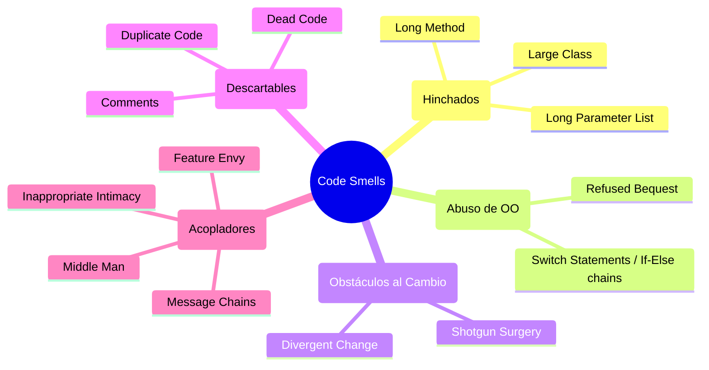

### Tabla de Equivalencias: Mal Olor → Refactoring Recomendado

| Mal Olor | Descripción / Síntoma | Refactoring Sugerido |
| :--- | :--- | :--- |
| **Duplicate Code** | Bloques de código idénticos, o estructuralmente muy similares, repetidos en varios lugares. | *Extract Method*, *Pull Up Method*, *Form Template Method*. |
| **Long Method** | Métodos con muchas líneas de código, difíciles de entender y con múltiples tareas. | *Extract Method*, *Replace Temp with Query*, *Decompose Conditional*. |
| **Large Class** | Clases con excesivos atributos y métodos. Sufren de baja cohesión y acumulación de responsabilidades. | *Extract Class*, *Extract Subclass*. |
| **Long Parameter List** | Firmas de métodos que reciben demasiados argumentos, reduciendo su legibilidad y facilidad de prueba. | *Replace Parameter with Method*, *Preserve Whole Object*, *Introduce Parameter Object*. |
| **Divergent Change** | Una sola clase se modifica frecuentemente por múltiples motivos de negocio diferentes. (Violación de SRP). | *Extract Class*. |
| **Shotgun Surgery** | Una sola modificación en una regla de negocio requiere pequeñas modificaciones dispersas en muchas clases distintas. | *Move Method*, *Move Field*. |
| **Feature Envy** *(Envidia de Atributo)* | Un método de la clase A accede repetidamente a los getters o atributos de la clase B para realizar cálculos, en lugar de interactuar con sus propios datos. | *Move Method*. |
| **Data Class** | Clases tontas que solo tienen getters y setters (estructuras de datos) pero no contienen lógica de negocio. | *Move Method* (llevar los comportamientos que consumen esos datos dentro de la clase). |
| **Switch Statements** | Cadenas condicionales (`switch` o `if-else` anidados) basadas en códigos de tipo para decidir qué comportamiento ejecutar. | *Replace Conditional with Polymorphism* (introduciendo Strategy o State). |
| **Message Chains** | Invocaciones largas y acopladas del estilo: `a.getB().getC().getD().hacerAlgo()`. | *Hide Delegate*. |
| **Middle Man** | Una clase que no hace ningún trabajo real y solo delega todas las llamadas a otro objeto. | *Remove Middle Man*. |
| **Comments** | Comentarios extensos que intentan explicar qué hace un bloque de código confuso o mal nombrado. | *Rename Method*, *Rename Variable*, *Extract Method*. |

---

## 🛠️ 3. Mecánica de Refactoring Clave

### 1. Extract Method *(Extraer Método)*
*   **Motivación:** Reducir el tamaño de métodos largos o aislar lógica duplicada.
*   **Precondición Crítica:** El bloque de código a extraer puede leer múltiples variables locales, pero **como máximo puede escribir/modificar 1 variable local** que sea necesitada posteriormente en el método original. Si modifica 2 o más, no es posible aplicar la extracción de forma directa.
*   **Mecánica:**
    1.  Crear un método con un nombre declarativo y claro.
    2.  Copiar el fragmento de código al nuevo método.
    3.  Pasar como parámetros las variables locales leídas.
    4.  Si el bloque modifica una variable local y se necesita después, retornarla y asignarla en el método origen.
    5.  Reemplazar el código extraído en el origen con la llamada al nuevo método.

### 2. Move Method *(Mover Método)*
*   **Motivación:** Eliminar *Feature Envy* moviendo el comportamiento a la clase que posee los datos.
*   **Mecánica:**
    1.  Examinar los atributos de la clase origen usados por el método y los atributos de la clase destino.
    2.  Declarar el método en la clase destino con el nombre adecuado.
    3.  Copiar el código, reemplazando referencias locales de la clase origen por llamadas a parámetros o a la instancia destino.
    4.  En la clase de origen, eliminar el cuerpo del método y hacer que delegue en la clase destino, o eliminar el método por completo si no hay más referencias.

### 3. Replace Temp with Query *(Reemplazar Temporal con Consulta)*
*   **Motivación:** Las variables temporales dificultan la extracción de métodos porque obligan a pasar muchos parámetros.
*   **Mecánica:**
    1.  Asegurar que la variable temporal se asigne **una única vez** (si no, aplicar *Split Temporary Variable*).
    2.  Extraer la expresión del lado derecho de la asignación a un nuevo método privado.
    3.  Reemplazar todas las referencias de la variable temporal por llamadas al nuevo método.
    4.  Eliminar la declaración y asignación de la variable temporal.

### 4. Pull Up Method y Pull Up Field
*   **Motivación:** Subir comportamiento y datos idénticos desde las subclases a la superclase.
*   **Precondición Crítica:** Para subir un método (`Pull Up Method`), cualquier atributo al que este acceda debe estar disponible en la superclase. Por ende, si el método accede a un atributo de la subclase, primero debe aplicarse `Pull Up Field` sobre dicho atributo.
*   **Mecánica:**
    1.  Asegurar que los métodos de las subclases tengan lógica idéntica.
    2.  Subir la firma y el cuerpo del método a la superclase.
    3.  Eliminar las declaraciones del método de las subclases.

### 5. Form Template Method *(Formar Método Plantilla)*
*   **Motivación:** Unificar la estructura general de un algoritmo compartido en subclases, aislando solo los pasos que varían.
*   **Mecánica:**
    1.  Aplicar *Extract Method* en las subclases sobre los pasos idénticos y sobre los pasos que difieren.
    2.  Asegurar que las firmas de estos métodos extraídos sean idénticas.
    3.  Aplicar *Pull Up Method* para subir el método principal (esqueleto) a la superclase abstracta.
    4.  Declarar los métodos variables como abstractos (*operaciones primitivas*) o con comportamiento por defecto (*hook methods*) en la superclase.

---

## 🔌 4. Patrones de Diseño (GoF)

Los patrones de diseño son soluciones abstractas y probadas a problemas comunes de software. Se dividen en tres categorías principales:
1.  **Creacionales:** Abstraen el proceso de instanciación de objetos.
2.  **Estructurales:** Tratan sobre la composición de clases u objetos para formar estructuras mayores.
3.  **De Comportamiento:** Se ocupan de la interacción y distribución de responsabilidades entre objetos.

---

### 4.1. Template Method (Comportamiento)

#### 🎯 Propósito
Define el esqueleto de un algoritmo en una operación, delegando algunos pasos específicos a las subclases. Permite que las subclases redefinan ciertos pasos de un algoritmo sin cambiar su estructura básica.

#### Estructura UML
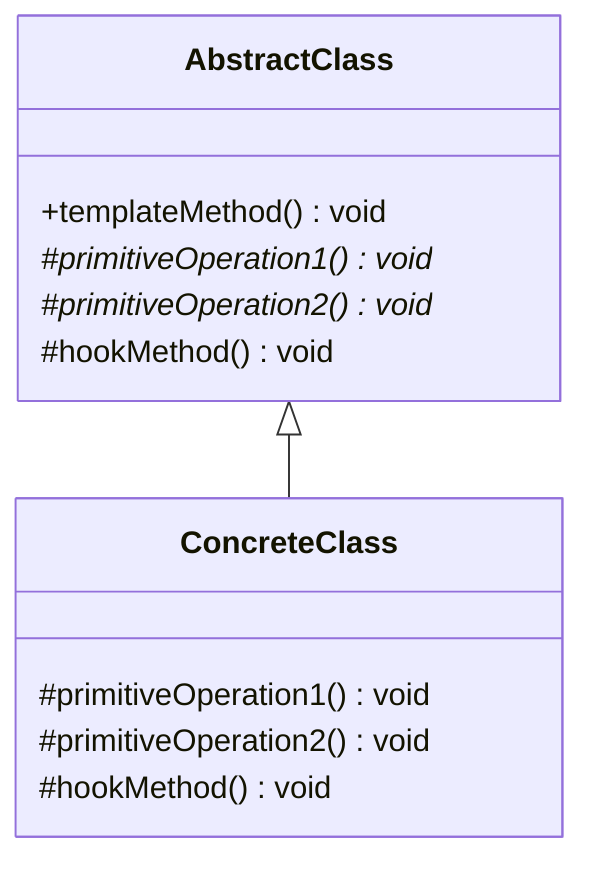

#### Conceptos Clave
*   **Template Method:** Método concreto (generalmente `final` en Java) que define la secuencia lógica del algoritmo.
*   **Operación Primitiva:** Método abstracto declarado en la superclase que las subclases **deben** implementar obligatoriamente.
*   **Hook Method (Método Gancho):** Método concreto con una implementación por defecto (vacía o básica) en la superclase. Las subclases **pueden** redefinirlo opcionalmente para intervenir en el flujo.
*   **Hollywood Principle (Hollywood Principle):** *"Don't call us, we'll call you"*. La superclase controla el flujo de ejecución e invoca los pasos definidos en las subclases cuando es necesario.

---

### 4.2. Adapter (Estructural)

#### 🎯 Propósito
Convierte la interfaz de una clase en otra interfaz que el cliente espera. Permite que clases con interfaces incompatibles trabajen juntas.

#### Estructura UML (Adapter de Objetos)
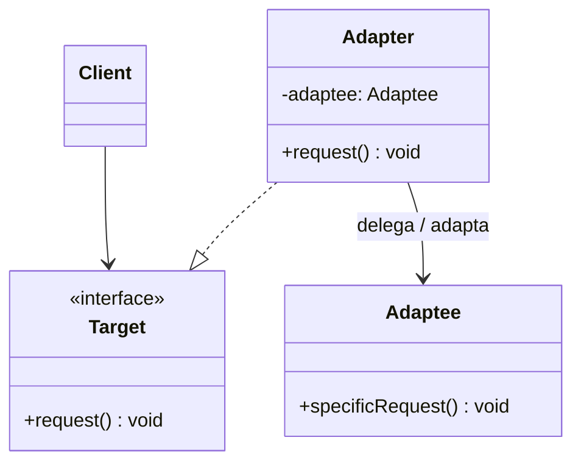

#### Participantes
*   **Target (Objetivo):** Define la interfaz específica que el cliente utiliza.
*   **Client (Cliente):** Colabora con objetos que implementan la interfaz `Target`.
*   **Adaptee (Adaptado):** Clase existente con interfaz incompatible que necesita ser integrada.
*   **Adapter (Adaptador):** Implementa la interfaz `Target` y delega internamente las llamadas a un objeto `Adaptee`, realizando la traducción de datos necesaria.

---

### 4.3. Composite (Estructural)

#### 🎯 Propósito
Compone objetos en estructuras de árbol para representar jerarquías parte-todo. Permite que los clientes traten a los objetos individuales (hojas) y a las composiciones de objetos (compuestos) de manera uniforme.

#### Estructura UML
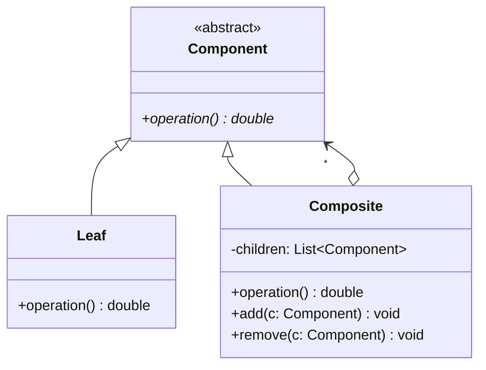

#### Variante de Diseño: ¿Seguridad o Transparencia?
*   **Transparencia (Transparent):** Los métodos de gestión de hijos (`add`, `remove`, `getChild`) se declaran en la superclase `Component`.
    *   *Pro:* **Uniformidad total**. El cliente no necesita conocer si interactúa con una hoja o un compuesto. No requiere downcasting.
    *   *Contra:* **Pérdida de seguridad**. Una hoja hereda estos métodos y, si se los invoca, debe lanzar una excepción (ej. `UnsupportedOperationException`) en tiempo de ejecución.
*   **Seguridad (Safe):** Los métodos de gestión de hijos se declaran **únicamente** en la subclase `Composite`.
    *   *Pro:* **Seguridad en tiempo de compilación**. Es imposible por sintaxis agregarle hijos a una hoja.
    *   *Contra:* **Pérdida de uniformidad**. El cliente debe preguntar el tipo (`instanceof`) y realizar un casteo explícito a `Composite` para manipular los hijos.

#### Referencias Circulares
Para evitar que un nodo se agregue a sí mismo o a uno de sus descendientes creando bucles infinitos en operaciones recursivas, el método `add()` del `Composite` debe realizar una **verificación de circularidad** (recorriendo hacia arriba los padres del nodo contenedor o buscando recursivamente en la rama).

---

### 4.4. Factory Method (Creacional)

#### 🎯 Propósito
Define una interfaz para la creación de un objeto, pero deja que las subclases decidan qué clase concreta instanciar. Permite delegar la instanciación a las subclases.

#### Estructura UML
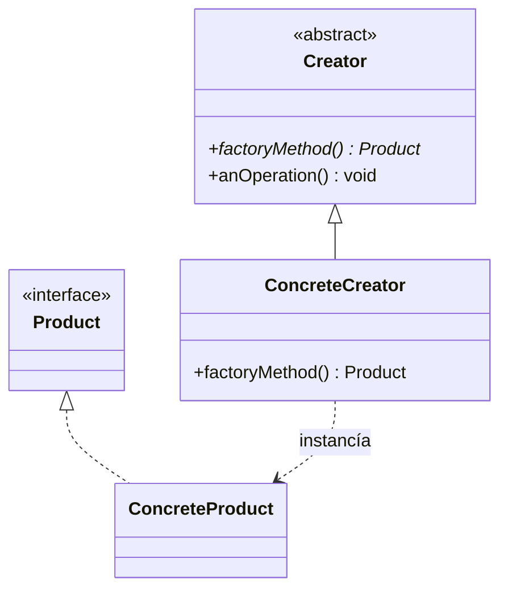

#### Concepto Clave
Desacopla al creador (`Creator`) de las clases concretas que necesita instanciar (`ConcreteProduct`), permitiendo extender y añadir nuevos productos al sistema sin modificar el código que orquesta el flujo de negocio (`anOperation()`).

---

### 4.5. Builder (Creacional)

#### 🎯 Propósito
Separa la construcción de un objeto complejo de su representación, permitiendo que el mismo proceso de construcción pueda crear diferentes representaciones.

#### Estructura UML
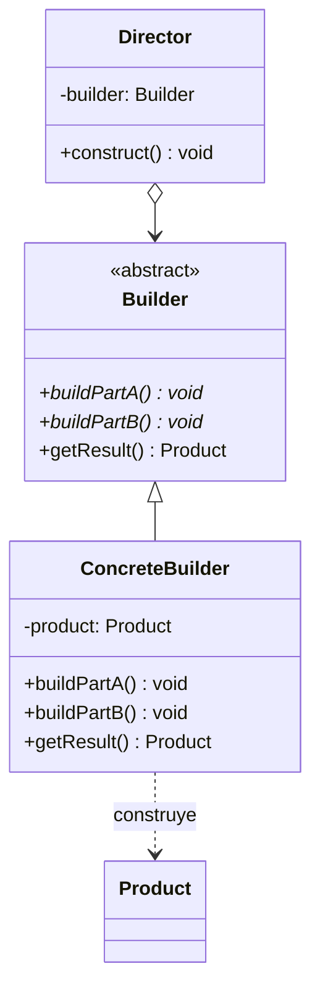

#### ⚔️ Factory Method vs Builder
*   **Factory Method:** Crea un objeto de una jerarquía mediante **un único paso** (retorna el objeto instanciado directamente).
*   **Builder:** Construye un objeto sumamente complejo en **múltiples pasos secuenciales** guiados por un **Director**. Mantiene el estado intermedio de la construcción y retorna el producto finalizado al concluir el proceso.

---

### 4.6. Strategy (Comportamiento)

#### 🎯 Propósito
Define una familia de algoritmos, encapsula cada uno de ellos y los hace intercambiables. Permite que el algoritmo varíe de forma independiente de los clientes que lo utilizan.

#### Estructura UML
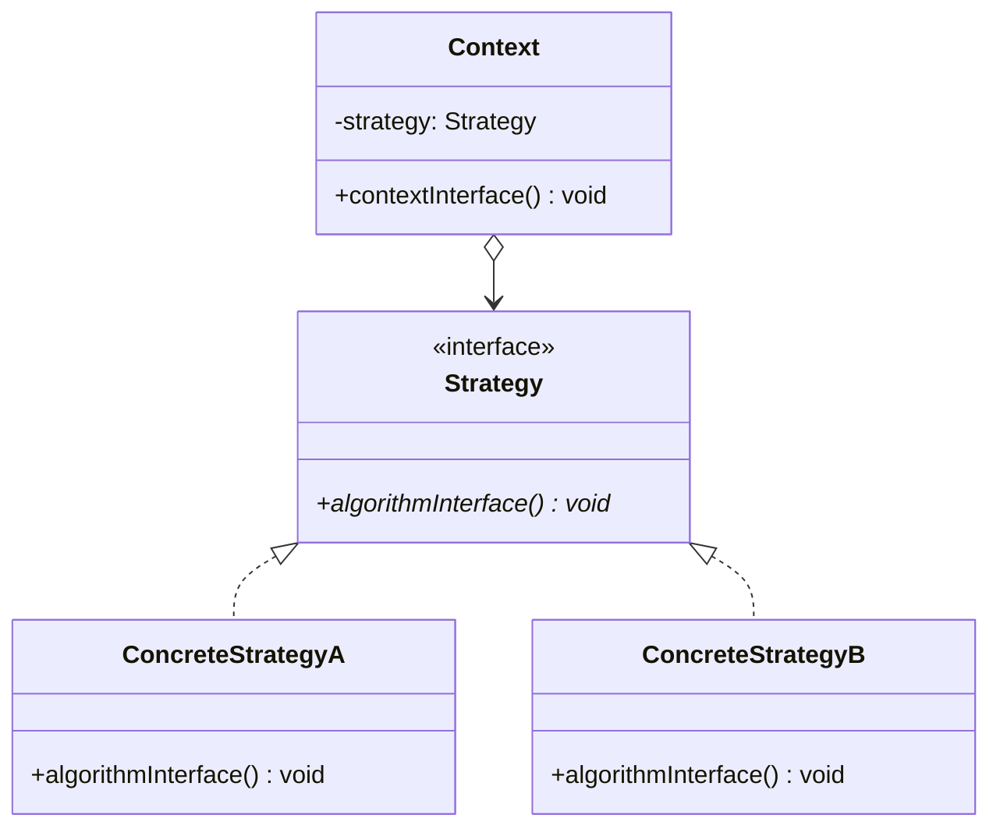

#### Concepto Clave
El cliente es quien suele **conocer y configurar** qué estrategia concreta inyectar en el contexto. El comportamiento encapsulado en la estrategia no suele cambiar constantemente a lo largo del ciclo de vida del contexto.

---

### 4.7. State (Comportamiento)

#### 🎯 Propósito
Permite que un objeto varíe su comportamiento cuando cambia su estado interno. El objeto parecerá cambiar de clase.

#### Estructura UML
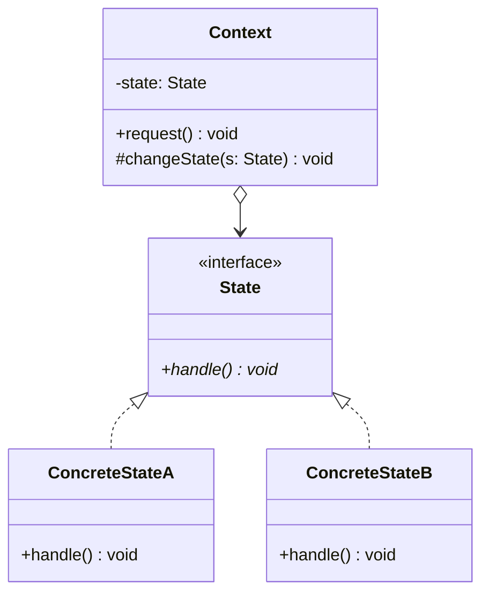

#### ¿Quién maneja las Transiciones de Estado?
1.  **En el Contexto (`Context`):** El contexto evalúa las condiciones y decide cuándo cambiar el estado actual.
    *   *Pro:* Estados concretos totalmente independientes e ignorantes entre sí.
    *   *Contra:* Se introduce lógica condicional en el contexto, dificultando la adición de nuevos estados.
2.  **En los Estados Concretos (`ConcreteState`):** Cada estado sabe a qué estado debe transicionar tras recibir una acción específica.
    *   *Pro:* Contexto extremadamente simple (solo delega). Agregar nuevos estados es más fácil y autónomo.
    *   *Contra:* Acoplamiento físico entre los estados concretos (deben instanciarse o conocerse entre sí).

#### ⚔️ Strategy vs State
*   **Intención:** Strategy encapsula un algoritmo alternativo; State encapsula comportamientos dependientes del ciclo de vida del objeto.
*   **Visibilidad:** El cliente selecciona activamente el Strategy; en State, el cliente suele interactuar con el contexto ignorando qué estado interno está activo.
*   **Transición:** Las estrategias no suelen cambiar durante la ejecución; los estados transicionan constantemente en runtime ante eventos del sistema.

---

### 4.8. Decorator (Estructural)

#### 🎯 Propósito
Añade responsabilidades adicionales a un objeto dinámicamente. Ofrece una alternativa flexible a la herencia para extender funcionalidad.

#### Estructura UML
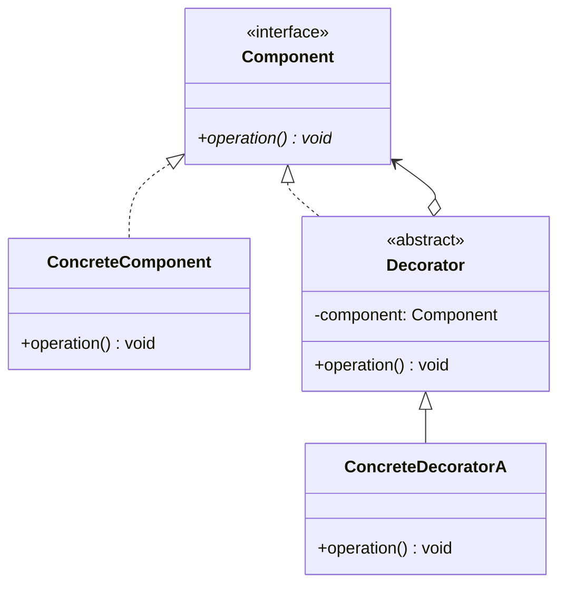

#### Concepto Clave
Permite envolver recursivamente objetos (`new DecoratorA(new DecoratorB(new ConcreteComponent()))`), donde cada decorador añade su comportamiento propio antes o después de delegar la llamada al componente envuelto.

---

### 4.9. Proxy (Estructural)

#### 🎯 Propósito
Proporciona un representante o sustituto de otro objeto para controlar el acceso a él.

#### Estructura UML
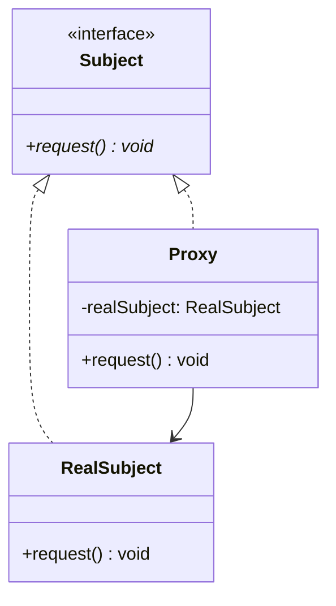

#### Tipologías de Proxies
*   **Virtual Proxy (Proxy Virtual):** Difiere la creación de un objeto costoso (carga lenta / *lazy loading*) hasta que es invocado por primera vez.
*   **Protection Proxy (Proxy de Protección):** Verifica permisos de seguridad o roles de usuario antes de autorizar el acceso al objeto real.
*   **Remote Proxy (Proxy Remoto):** Proporciona una interfaz local para un objeto que se ejecuta en otra máquina, red o proceso, abstrayendo las llamadas por socket.

#### ⚔️ Decorator vs Proxy
*   **Decorator:** Su intención es **añadir responsabilidades** de forma dinámica y recursiva. El objeto a decorar se crea externamente y se inyecta en el constructor.
*   **Proxy:** Su intención es **controlar el acceso** al objeto real de forma transparente. El Proxy controla internamente el ciclo de vida del objeto real (lo instancia él mismo cuando es necesario). No se suele usar de forma recursiva.

---

## 👥 5. Testing Unitario y Dobles de Prueba (Test Doubles)

Para realizar pruebas unitarias sobre un componente (SUT - *System Under Test*) de forma rápida, aislada y determinista, se reemplazan sus colaboradores reales por **dobles de prueba** (taxonomía de Gerard Meszaros):

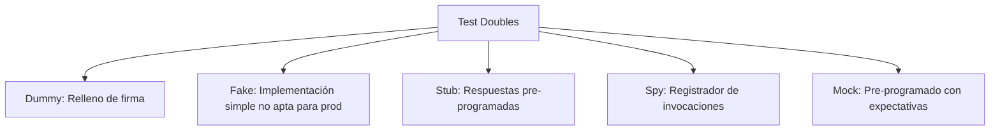

### Clasificación
1.  **Dummy:** Objeto que se pasa solo como argumento en parámetros obligatorios pero nunca recibe mensajes en el test.
2.  **Fake:** Implementación funcional real pero simplificada (ej. base de datos en memoria o un archivo simulado en un Map).
3.  **Stub:** Responde con datos fijos o "enlatados" ante consultas que le realiza el SUT (ej. forzar que un método retorne siempre `true`).
4.  **Spy:** Envuelve un objeto registrando qué métodos fueron volcados, cuántas veces y con qué parámetros para validarlo posteriormente.
5.  **Mock:** Objeto programado con expectativas explícitas sobre las llamadas que debería recibir. Se valida a sí mismo al finalizar la ejecución del test.

### ⚔️ Verificación de Estado vs Verificación de Comportamiento
*   **Verificación de Estado:** Se evalúa si los valores de los atributos finales o el retorno del SUT son correctos usando aserciones (`assertEquals`).
*   **Verificación de Comportamiento:** Se evalúa si el SUT interactuó correctamente con sus colaboradores enviando los mensajes esperados con los parámetros adecuados (`verify(mock).metodo(...)` en Mockito).

---

## 🏗️ 6. Arquitectura de Frameworks

Un **Framework** es un conjunto de clases que cooperan entre sí para constituir un diseño reutilizable para una clase específica de software.

### ⚔️ Framework vs Biblioteca (Library)
La diferencia radica en la **Inversión de Control (IoC)** o **Principio de Hollywood** (*"Don't call us, we'll call you"*):
*   **Biblioteca:** Tu código tiene el control del flujo y decide cuándo invocar a la biblioteca.
*   **Framework:** El motor del framework controla el flujo principal de ejecución y llama a tu código personalizado en puntos estratégicos.

### Hot Spots vs Frozen Spots
*   **Frozen Spots (Puntos Congelados):** Código fijo e inmutable del framework que define la arquitectura y el ciclo de vida básico de la aplicación.
*   **Hot Spots (Puntos Calientes / Extensión):** Puntos de variación diseñados específicamente para que el programador inyecte su comportamiento particular.

### Clasificación por su Extensión

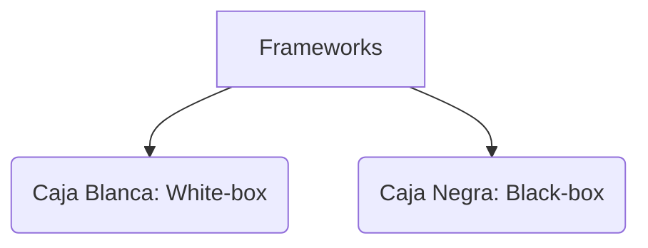

| Criterio | Caja Blanca (White-box) | Caja Negra (Black-box) |
| :--- | :--- | :--- |
| **Mecanismo de extensión** | **Herencia**. El programador hereda de clases abstractas del framework. | **Composición**. El programador implementa interfaces y las registra (plugins). |
| **Patrón dominante** | **Template Method**. | **Strategy**, **Observer**, **State**. |
| **Momento de configuración** | Tiempo de compilación (estático). | Tiempo de ejecución (dinámico). |
| **Acoplamiento** | Alto (las clases de la aplicación dependen del código interno de la superclase). | Bajo (interacción basada estrictamente en interfaces estables). |
| **Flexibilidad** | Limitada por la jerarquía rígida de clases de Java. | Alta (permite inyectar y cambiar componentes libremente). |

> [!TIP]
> **Evolución típica de los Frameworks:** Por simplicidad de diseño, los frameworks suelen nacer como frameworks de **caja blanca** (usando herencia) y evolucionan con sucesivos refactorings hacia frameworks de **caja negra** (usando composición) para dar más desacoplamiento y dinamismo.
