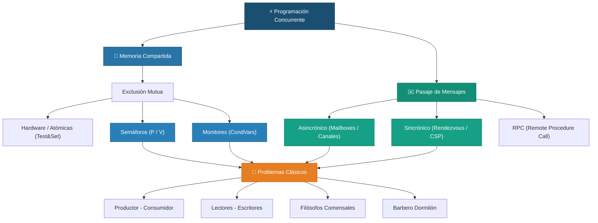

  

  
  
  
  

  

---

Repositorio de estudio personal para la materia **Programación Concurrente (PC)**, correspondiente al 3er año (2do semestre) de la carrera Licenciatura en Sistemas / Licenciatura en Informática / Analista en TIC (UNLP).  
**Docentes:** Cátedra de la Facultad de Informática UNLP

 

## 📖 Resúmenes de Teoría (Organizados por Ejes Temáticos)

Cada resumen incluye explicaciones detalladas, algoritmos de sincronización, pseudocódigo formal y trazas de ejecución.

### 🧠 Eje 1: Memoria Compartida (Shared Memory)
| Unidad | Tema Principal | Conceptos Clave | Link |
|:---:|---|---|:---:|
| **1** | Fundamentos de Concurrencia y Atomicidad | Concurrencia vs Paralelismo · UMA/NUMA · Sentencias Guardadas · Atomicidad de Grano Fino · ASV · Notación `⟨await⟩` · Safety & Liveness · Fairness | [📄](Teoria/Resumenes/Clase1_Fundamentos_Concurrencia.md) |
| **2** | Semáforos | Primitivas `P()` (wait) y `V()` (signal) · Semáforos Generales y Binarios (Mutex) · Sincronización y Barreras | 📄 *Próximamente* |
| **3** | Monitores | Encapsulamiento · Variables de Condición (`wait`, `signal`, `signal_all`) · Semánticas de Señalización (Hoare vs Mesa/Java) | 📄 *Próximamente* |

### ✉️ Eje 2: Pasaje de Mensajes (Message Passing / Memoria Distribuida)
| Unidad | Tema Principal | Conceptos Clave | Link |
|:---:|---|---|:---:|
| **4** | Mensajes Asincrónicos (PMA) | Canales y Mailboxes · `send()` no bloqueante y `receive()` bloqueante · Topologías y protocolos | 📄 *Próximamente* |
| **5** | Mensajes Sincrónicos (PMS) | Comunicación directa y simétrica/asimétrica · Rendezvous · Sentencias selectivas con guarda (`select` / `alt`) | 📄 *Próximamente* |
| **6** | Invocación Remota (RPC / Rendezvous Avanzado) | Llamada a Procedimiento Remoto (RPC) · Modelos Cliente-Servidor distribuidos | 📄 *Próximamente* |

### 🧩 Eje 3: Problemas Clásicos de Concurrencia
| Problema | Descripción | Técnicas de Solución | Link |
|:---:|---|---|:---:|
| **Productor - Consumidor** | Acceso coordinado a un buffer acotado (*bounded buffer*) | Semáforos contadores · Monitores con variables de condición · Canales de mensajes | 📄 *Próximamente* |
| **Lectores - Escritores** | Acceso concurrente a base de datos / recursos compartidos | Prioridad a Lectores vs Prioridad a Escritores · Exclusión mutua selectiva | 📄 *Próximamente* |
| **Filósofos Comensales** | Manejo de recursos múltiples y prevención de interbloqueos | Prevención de Deadlock · Rompimiento de simetría · Asignación atómica de recursos | 📄 *Próximamente* |
| **Barbero Dormilón** | Coordinación entre clientes y servidor con sala de espera | Semáforos de sincronización y conteo de turnos | 📄 *Próximamente* |

 

> 📂 **Material oficial de cátedra (PDFs originales):** [Abrir directorio](Teoria/Material_Original/)

---

 

## 💻 Prácticas Resueltas

| # | Tema | Herramientas / Lenguajes | Link |
|:-:|---|---|:-:|
| **1** | Variables Compartidas y Algoritmos de Exclusión Mutua | Pseudocódigo / Pascal-FC / C | [📁](Practicas/Practica_1/) |
| **2** | Semáforos | Pascal-FC / C (POSIX Threads / Semaphores) | [📁](Practicas/Practica_2/) |
| **3** | Monitores | Pascal-FC / Java (synchronized, ReentrantLock) | [📁](Practicas/Practica_3/) |
| **4** | Pasaje de Mensajes Asincrónico (PMA) | PMS/PMA Pseudocódigo | [📁](Practicas/Practica_4/) |
| **5** | Pasaje de Mensajes Sincrónico (PMS) y Rendezvous | CSP / Ada | [📁](Practicas/Practica_5/) |

---

 

## 🗺️ Mapa Conceptual de Concurrencia

---

 

## 📝 Evaluaciones

Material de preparación, exámenes parciales y finales anteriores resueltos.

📁 [Abrir directorio de Evaluaciones](Evaluaciones/)

---

 

## 🛠️ Stack Tecnológico

  

  <b>C / Pthreads</b> · <b>Java Concurrency</b> · <b>POSIX</b> · <b>Linux</b> · <b>Git & GitHub</b>

---

  

  Repositorio de uso personal y académico · Material de cátedra © sus respectivos autores
   
  Hecho con 💙 por <a href="https://github.com/auwus21">@auwus21</a>

