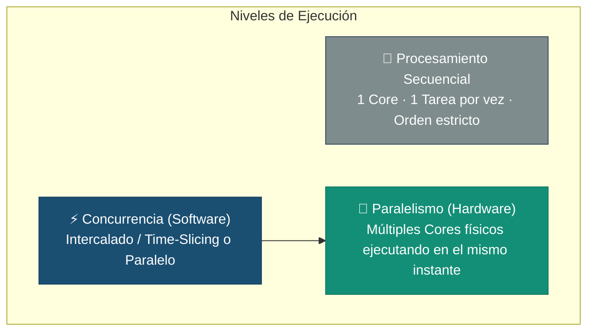
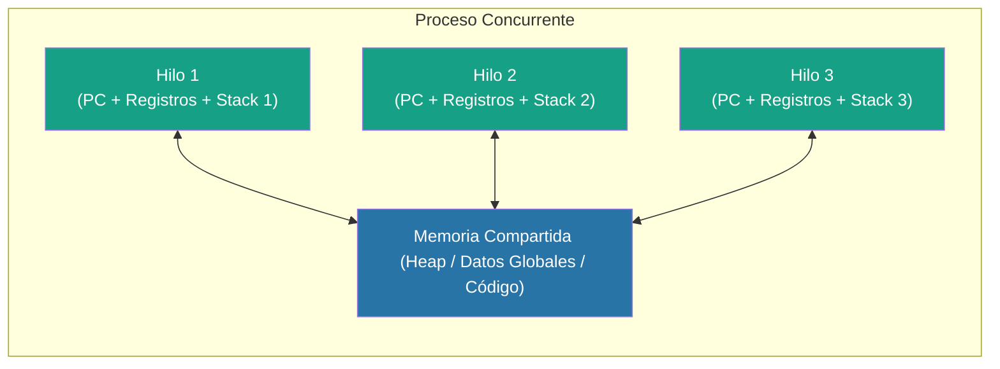
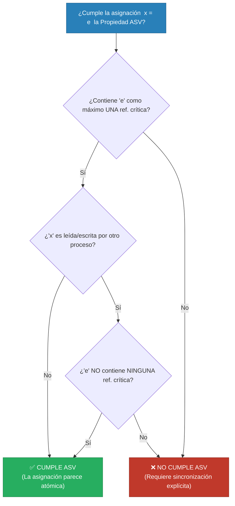
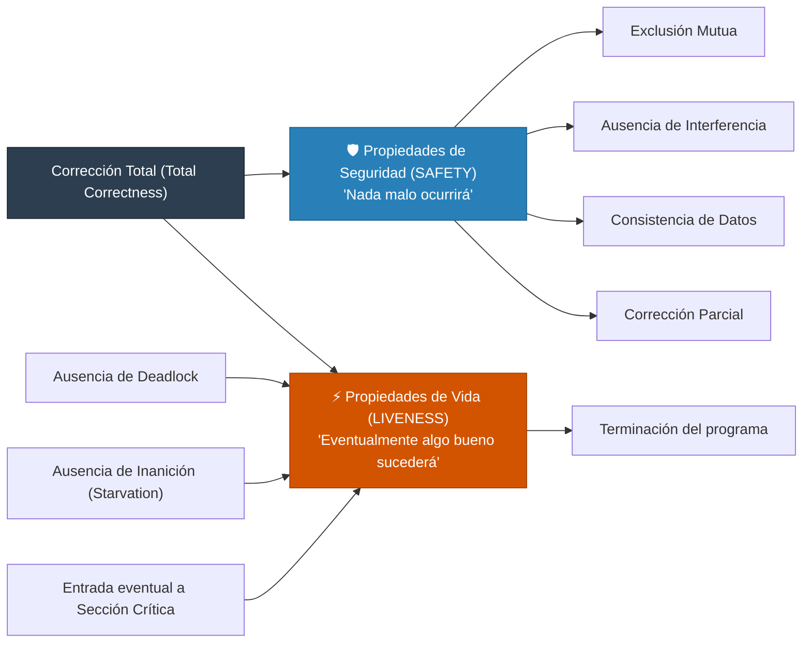
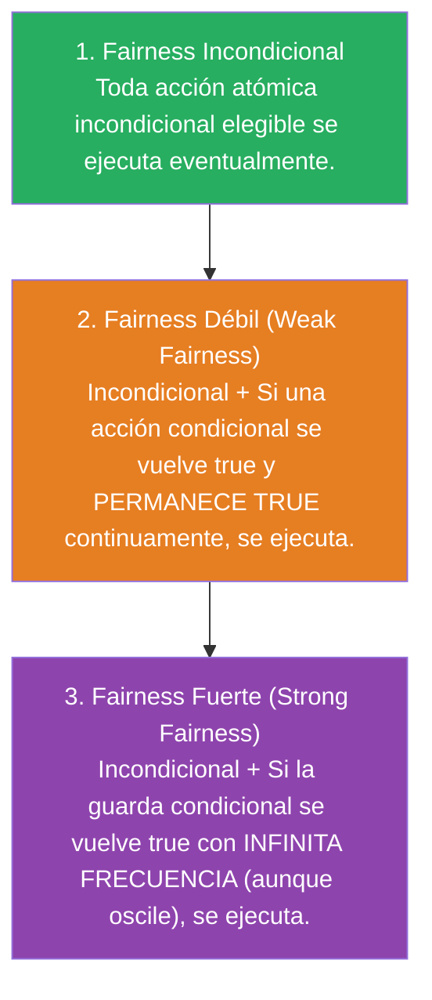

# 📘 Clase 1: Fundamentos de Concurrencia, Atomicidad y Sincronización

**Materia:** Programación Concurrente (PC) — UNLP  
**Bibliografía base:** *Foundations of Multithreaded, Parallel, and Distributed Programming* (Gregory Andrews)  
**Temas:** Conceptos de Concurrencia y Paralelismo, Procesos vs Hilos, Arquitecturas de Memoria (UMA / NUMA / Distribuida), Clases de Instrucciones (Sentencias Guardadas, `co...oc`, `process`), Atomicidad de Grano Fino, Propiedad "A lo Sumo Una Vez" (ASV), Notación Formal `⟨await⟩`, Propiedades de Corrección (Safety vs Liveness) y Tipos de Fairness.

---

## 📑 Tabla de Contenidos
1. [🌟 Motivación y Conceptos Fundamentales](#-motivación-y-conceptos-fundamentales)
2. [⚙️ Concurrencia vs. Paralelismo vs. Secuencialidad](#️-concurrencia-vs-paralelismo-vs-secuencialidad)
3. [🧵 Procesos, Hilos y Formas de Interacción](#-procesos-hilos-y-formas-de-interacción)
4. [🏗️ Concurrencia a Nivel de Hardware y Memoria](#️-concurrencia-a-nivel-de-hardware-y-memoria)
5. [🔀 Clases de Instrucciones y Sentencias Guardadas (Andrews / Dijkstra)](#-clases-de-instrucciones-y-sentencias-guardadas-andrews--dijkstra)
6. [🔬 Atomicidad de Grano Fino e Historias de Ejecución (Traces)](#-atomicidad-de-grano-fino-e-historias-de-ejecución-traces)
7. [🎯 Propiedad "A lo Sumo Una Vez" (ASV / At-Most-Once)](#-propiedad-a-lo-sumo-una-vez-asv--at-most-once)
8. [🛡️ Especificación Formal de Sincronización: La Notación `⟨await⟩`](#️-especificación-formal-de-sincronización-la-notación-await)
9. [⚖️ Propiedades de los Programas Concurrentes: Safety vs. Liveness](#️-propiedades-de-los-programas-concurrentes-safety-vs-liveness)
10. [🚦 Políticas de Scheduling y Fairness (Imparcialidad)](#-políticas-de-scheduling-y-fairness-imparcialidad)

---

## 🌟 Motivación y Conceptos Fundamentales

### ¿Qué es la Concurrencia?
La **concurrencia** es la propiedad de los sistemas en los que múltiples actividades computacionales se ejecutan de manera simultánea o superpuesta en el tiempo, pudiendo interactuar entre sí para compartir recursos o cooperar en una tarea común.

> [!NOTE]
> **Definición Clave:** La concurrencia es un **concepto lógico de software**. No está restringido a una arquitectura física en particular ni a una cantidad determinada de núcleos o procesadores.

### ¿Dónde se encuentra?
*   **En la naturaleza y biología:** Los organismos biológicos son masivamente concurrentes (millones de células interactuando independientemente).
*   **En sistemas informáticos:** 
    *   Un navegador web descargando recursos en paralelo mientras responde al clic del usuario.
    *   Servidores web atendiendo miles de conexiones entrantes simultáneas.
    *   Sistemas de control en tiempo real (sensores de frenado ABS, monitoreo médico).

### Concurrencia "Natural" vs. Forzado Secuencial
Muchos problemas del mundo real son intrínsecamente concurrentes. Intentar resolverlos con un enfoque secuencial puro resulta en código artificialmente complejo, rígido y frágil.

```
Problema: Desplegar un cartel ROJO cada 3 segundos y un cartel AZUL cada 5 segundos.
```

| Enfoque Secuencial | Enfoque Concurrente (Natural) |
|---|---|
| Requiere calcular mínimos comunes múltiplos, variables de control temporal explícitas (`Proximo_Rojo`, `Proximo_Azul`, `Actual`) y un único bucle centralizado. | Se modela cada cartel como un proceso independiente y modular. |
| Agregar un tercer cartel (ej. VERDE cada 7s) rompe y complejiza toda la lógica central. | Agregar nuevos elementos simplemente implica lanzar un nuevo proceso sin modificar los existentes. |

```pascal
// Enfoque Concurrente Natural:
process Cartel (color: string; intervalo: int) {
    while (true) {
        demorar(intervalo);
        desplegar_cartel(color);
    }
}
```

### El Fin del "Free Lunch" (Límite Físico de CPU)
Históricamente, los procesadores aumentaban su velocidad de reloj (*clock speed*) año a año. Debido a límites de disipación térmica y consumo energético (*Dennard Scaling*), la industria viró hacia arquitecturas **Multi-core** y procesadores masivamente paralelos (GPUs). Para aprovechar el hardware moderno, la programación concurrente es una necesidad ineludible.

---

## ⚙️ Concurrencia vs. Paralelismo vs. Secuencialidad



### Cuadro Comparativo Riguroso

| Dimensión | Secuencial | Concurrente (Monoprocesador) | Paralelo (Multiprocesador) |
|---|---|---|---|
| **Cores físicos** | 1 | 1 | $M > 1$ |
| **Flujos de control ($N$)** | 1 | $N > 1$ | $N > 1$ |
| **Simultaneidad Real** | No | No (Pseudo-simultaneidad por *time-slicing*) | **Sí** (Ejecución física simultánea) |
| **Naturaleza** | Algorítmica | Concepto de **Software** | Propiedad de **Hardware / Ejecución** |
| **Objetivo central** | Simplicidad / Determinismo | Modularidad, estructuración natural, superposición de E/S | **Minimizar tiempo de ejecución** (*Speedup*) |

> [!IMPORTANT]
> **Regla de Inclusión:** *Todo sistema paralelo es concurrente, pero no todo sistema concurrente es necesariamente paralelo.*

---

## 🧵 Procesos, Hilos y Formas de Interacción

### Procesos Pesados vs. Hilos (Threads / Procesos Livianos)

*   **Proceso (Heavyweight):** Entidad con su propio espacio de direcciones de memoria virtual, descriptores de archivos, privilegios y bloque de control (PCB). La comunicación entre procesos requiere mecanismos explícitos provistos por el SO (pipes, sockets, memoria compartida mapeada).
*   **Hilo (Lightweight Process):** Unidad de ejecución dentro de un proceso. Comparte el espacio de direcciones, variables globales y recursos del proceso padre; posee su propia pila (*stack*), registros de CPU y Program Counter (PC). El cambio de contexto entre hilos es mucho más liviano que entre procesos.



### Relaciones entre Procesos Concurrentes

1.  **Independientes:** Procesos que no interactúan ni comparten datos. Raros en sistemas complejos.
2.  **Competencia (Competition):** Procesos que no colaboran intencionalmente, pero compiten por recursos finitos compartidos (CPU, archivos, impresora, memoria). Típico en el diseño de Sistemas Operativos.
3.  **Cooperación (Cooperation):** Procesos diseñados específicamente para interactuar y resolver un objetivo común. Requieren **sincronización** y **comunicación**.

---

## 🏗️ Concurrencia a Nivel de Hardware y Memoria

### 1. Multiprocesadores de Memoria Compartida (Shared Memory)
Todos los procesadores acceden a un espacio de memoria físico o virtual común.

*   **UMA (Uniform Memory Access / SMP):** Todos los procesadores comparten la memoria principal mediante un bus del sistema o conmutador (*crossbar*). El tiempo de acceso a cualquier dirección es idéntico para cualquier CPU.
*   **NUMA (Non-Uniform Memory Access):** La memoria está físicamente particionada y ligada a nodos de CPU específicos. Un procesador accede más rápido a su memoria local que a la memoria de otro nodo (*remota*).
*   **GPUs (Graphic Processing Units):** Arquitecturas masivamente paralelas orientadas al cómputo vectorial (SIMD/SIMT) organizadas en *Streaming Multiprocessors* (SM) compartiendo jerarquías de caché L1/L2 y memoria global GDDR.

```
       [ UMA - Memoria Simétrica ]                     [ NUMA - Memoria No Uniforme ]
   CPU 1      CPU 2       CPU N                   CPU 1 + Local Mem    CPU 2 + Local Mem
     │          │           │                             ▲                    ▲
     └──────────┴─────┬─────┘                             └──────────┬─────────┘
                      ▼                                              ▼
               [ Memoria Global ]                          [ Red de Interconexión ]
```

### 2. Multiprocesadores de Memoria Distribuida (Distributed Memory)
Procesadores autónomos conectados a través de una red física (Clusters, Redes locales, Grids, Clouds).
*   Cada nodo tiene su memoria estrictamente privada.
*   La interacción se realiza **exclusivamente por Pasaje de Mensajes**.

---

## 🔀 Clases de Instrucciones y Sentencias Guardadas (Andrews / Dijkstra)

Para modelar formalmente la concurrencia, utilizamos la sintaxis abstracta introducida por Edsger Dijkstra y formalizada por Gregory Andrews.

### 1. Asignaciones y Control Base
*   **Asignación simple:** `x = e`
*   **Asignación compuesta / paralela:** `x = x + 1; y = y - 1`
*   **Swap (intercambio atómico):** `v1 :=: v2`
*   **Sentencia nula:** `skip` (termina inmediatamente sin modificar el estado).

### 2. Sentencia de Alternativa Múltiple (`if...fi`)
Sintaxis:
```pascal
if B1 -> S1
[] B2 -> S2
...
[] Bn -> Sn
fi
```
*   $B_i$ son expresiones booleanas llamadas **guardas**.
*   Se evalúan las guardas:
    *   Si **ninguna** guarda es verdadera $\rightarrow$ el `if` no tiene efecto y finaliza.
    *   Si **una sola** guarda es verdadera $\rightarrow$ se ejecuta su sentencia asociada $S_i$.
    *   Si **más de una** guarda es verdadera $\rightarrow$ la selección es **no determinística** (se elige arbitrariamente una de las opciones válidas).

### 3. Sentencia Iterativa Múltiple (`do...od`)
Sintaxis:
```pascal
do B1 -> S1
[] B2 -> S2
...
[] Bn -> Sn
od
```
*   El bucle continúa evaluando las guardas en cada iteración.
*   En cada paso, selecciona de forma no determinística una sentencia cuya guarda sea `true`.
*   El bucle **termina únicamente cuando TODAS las guardas son falsas**.

### 4. Cuantificador de Iteración (`fa...af` - For All)
Permite expresar repetición sobre rangos con restricciones (*such that* - `st`):
```pascal
fa i := 1 to n, j := i+1 to n st a[i] > a[j] ->
    a[i] :=: a[j]
af
```

### 5. Sentencias para Concurrencia: `co...oc` vs. `process`

```pascal
// Sentencia CO (Sincronización Fork-Join):
co S1 // S2 // ... // Sn oc
```
*   Lanza las sentencias $S_1, \dots, S_n$ concurrentemente.
*   **Semántica de barrera:** El hilo de ejecución que contiene al `co...oc` **se bloquea** y espera hasta que **todas** las ramas hijas $S_i$ hayan finalizado.

```pascal
// Declaración PROCESS (Ejecución en Background):
process Lector [i = 1 to N] {
    // Código del proceso que se ejecuta indefinidamente en background
}
```
*   Crea instancias de procesos independientes que se ejecutan en segundo plano (*background*). El programa padre continúa sin esperarlos inmediatamente.

---

## 🔬 Atomicidad de Grano Fino e Historias de Ejecución (Traces)

### Concepto de Acción Atómica
Una **acción atómica** realiza una transformación de estado de forma **indivisible**. Durante su ejecución:
1.  Ningún estado intermedio es visible para otros procesos.
2.  Ningún otro proceso puede interferir en los datos que manipula mientras se ejecuta.

### Interleaving (Intercalado) e Historia (Trace)
La ejecución de un programa concurrente sobre memoria compartida se define como el **intercalado arbitrario** de las acciones atómicas de grano fino ejecutadas por cada proceso. Una **historia** o *trace* es una secuencia particular de intercalado.

```
Ejemplo: x = 0; y = 4; z = 2;
co
    x = y + z   (Proceso 1)
//  y = 3       (Proceso 2)
//  z = 4       (Proceso 3)
oc
```

A nivel de hardware, `x = y + z` no es una sola instrucción; se descompone en:
*   `(1.1)` `Load y, RegA`
*   `(1.2)` `Add z, RegA`
*   `(1.3)` `Store RegA, x`

Dependiendo de cuándo se ejecuten `Store 3, y` (Proceso 2) y `Store 4, z` (Proceso 3):
*   Si Proceso 1 lee `y` y `z` al inicio $\rightarrow x = 4 + 2 = 6$.
*   Si Proceso 2 escribe antes y Proceso 3 después $\rightarrow x = 3 + 2 = 5$.
*   Si Proceso 3 escribe antes y Proceso 2 después $\rightarrow x = 4 + 4 = 8$.
*   Si ambos escriben antes de que Proceso 1 lea $\rightarrow x = 3 + 4 = 7$.

### El "Interleaving Extremo" de Ben-Ari & Burns
Consideremos dos procesos concurrentes ejecutando cada uno $N$ incrementos sobre una variable compartida `X`:

```pascal
int X = 0;
co
    for [i = 1 to N] -> X = X + 1;
//  for [j = 1 to N] -> X = X + 1;
oc
```

¿Cuáles son los posibles valores finales de `X`?
*   **Máximo ($2N$):** Ambos procesos se intercalan perfectamente sin solapamiento destructivo.
*   **Valor esperado típico ($N$ a $2N-1$):** Pérdidas parciales de actualizaciones.
*   **Mínimo absoluto ($2$):** Demostrado por Burns; un proceso lee $X=0$, se suspende mientras el otro completa $N-1$ iteraciones, luego sobreescribe $X=1$; repitiendo la maniobra en la última iteración, el resultado final puede ser **2**, independientemente de lo grande que sea $N$.

> [!CAUTION]
> **Conclusión:** Nunca se debe confiar en la intuición secuencial ni en la velocidad relativa del hardware para predecir el comportamiento concurrente.

---

## 🎯 Propiedad "A lo Sumo Una Vez" (ASV / At-Most-Once)

Para no tener que analizar siempre el código a nivel de instrucciones de ensamblador (*load/store*), formalizamos la **Propiedad ASV**, que garantiza cuándo una expresión o asignación de alto nivel se comporta como si fuera atómica.

### Definición de Referencia Crítica
Una referencia a una variable en un proceso es una **referencia crítica** si esa variable es **modificada por otro proceso concurrente**.

### Reglas Formales de ASV:



1.  **Para una Asignación `x = e`:**
    *   **Caso A:** La expresión `e` contiene **a lo sumo una referencia crítica** y la variable de destino `x` **no es referenciada** por ningún otro proceso.
    *   **Caso B:** La expresión `e` **no contiene ninguna referencia crítica**, en cuyo caso la variable de destino `x` **puede ser leída** por otros procesos.
2.  **Para una Expresión `e` suelta (ej. condiciones en bucles/ifs):**
    *   Satisface ASV si contiene **a lo sumo una referencia crítica**.

### Ejemplos Prácticos de Evaluación ASV:

```pascal
// Supongamos variables inicializadas en x = 0, y = 0

// Ejemplo 1:
co x = x + 1 // y = y + 1 oc
// P1 modifica 'x' (no es crítica porque P2 no la usa).
// P2 modifica 'y' (no es crítica porque P1 no la usa).
// Resultado: 0 refs críticas en ambos -> CUMPLE ASV (x=1, y=1 siempre).

// Ejemplo 2:
co x = y + 1 // y = y + 1 oc
// En P1: 'y' es modificada por P2 (1 ref crítica). 'x' no es usada por P2. -> CUMPLE ASV.
// En P2: 'y' no tiene refs críticas en la derecha. -> CUMPLE ASV.
// Resultados posibles válidos: y = 1; x = 1 ó x = 2.

// Ejemplo 3:
co x = y + 1 // y = x + 1 oc
// En P1: 'y' es ref crítica Y 'x' es leída por P2. -> NO CUMPLE ASV.
// En P2: 'x' es ref crítica Y 'y' es leída por P1. -> NO CUMPLE ASV.
// Peligro: Podría darse x = 1, y = 1 debido a lecturas desincronizadas.
```

---

## 🛡️ Especificación Formal de Sincronización: La Notación `⟨await⟩`

Cuando una sentencia no cumple ASV o se requiere coordinar procesos sobre una condición compleja, se emplean **acciones atómicas de grano grueso** (*coarse-grained*), representadas formalmente mediante la notación de corchetes angulares `⟨ ⟩` y sentencias `await`.

### 1. Evaluación Atómica Simple
`⟨ e ⟩`: Indica que la expresión `e` se evalúa como una única acción indivisible.

### 2. Sentencia General `⟨await (B) S;⟩`
```pascal
<await (B) S;>
```
*   **Condición de demora ($B$):** Expresión booleana que debe ser verdadera para proceder.
*   **Cuerpo ($S$):** Secuencia de instrucciones que se garantiza que finaliza.
*   **Semántica:** El proceso se detiene hasta que $B$ sea `true`. En el instante en que $B$ es `true`, $S$ se ejecuta de forma atómica y completa. Durante la ejecución de $S$, ningún estado intermedio es visible.

### Casos Especiales de `⟨await⟩`

| Tipo | Sintaxis | Propósito | Implementación Práctica |
|---|---|---|---|
| **Exclusión Mutua** | `⟨ S; ⟩` o `⟨await (true) S;⟩` | Ejecutar $S$ indivisiblemente sin evaluar condiciones previas. | Locks, Mutex, `Test-and-Set`. |
| **Sincronización por Condición** | `⟨await (B)⟩` | Esperar a que se cumpla la condición $B$. | Variable de Condición, Semáforo, o *Busy Waiting* (`while (!B);` si $B$ cumple ASV). |
| **Sincronización General** | `⟨await (s > 0) s = s - 1;⟩` | Esperar condición y transformar estado atómicamente. | Primitiva `P(s)` de un semáforo de Dijkstra. |

### Ejemplo: Productor - Consumidor con Buffer Acotado
Formalización elegante con `⟨await⟩`:

```pascal
int cant = 0;
cola Buffer;
const int N = 10;

process Productor {
    tipoElemento elemento;
    while (true) {
        elemento = generar_elemento();
        <await (cant < N); push(Buffer, elemento); cant++;>
    }
}

process Consumidor {
    tipoElemento elemento;
    while (true) {
        <await (cant > 0); elemento = pop(Buffer); cant--;>
        consumir_elemento(elemento);
    }
}
```

---

## ⚖️ Propiedades de los Programas Concurrentes: Safety vs. Liveness

Toda propiedad de corrección de un sistema concurrente se clasifica en una de dos categorías fundamentales (formuladas formalmente por Leslie Lamport):



### 1. Propiedades de Seguridad (Safety)
*   **Lema:** *"Nada malo ocurrirá durante la ejecución."*
*   Aseguran que el sistema jamás entre en un estado inconsistente o no permitido.
*   Si una propiedad de seguridad se viola, se puede identificar un **prefijo finito** de la historia donde ocurrió el fallo.
*   **Ejemplos:**
    *   Exclusión mutua en secciones críticas (nunca hay dos procesos simultáneamente en la SC).
    *   Ausencia de división por cero o punteros nulos.
    *   Corrección parcial (*Partial Correctness*): Si el programa termina, la salida es la correcta.

### 2. Propiedades de Vida (Liveness)
*   **Lema:** *"Eventualmente ocurrirá algo bueno."*
*   Aseguran que el sistema progrese y no quede estancado indefinidamente.
*   Una violación de vida no puede identificarse en un prefijo finito de tiempo (siempre cabe la posibilidad de que "lo bueno ocurra más adelante en el infinito").
*   **Ejemplos:**
    *   Terminación (*Termination*): El programa eventualmente finaliza.
    *   Ausencia de *Deadlock* (Interbloqueo).
    *   Ausencia de *Starvation* (Inanición): Todo proceso que solicita un recurso eventualmente lo obtiene.
    *   Entrega garantizada de mensajes.

> [!NOTE]
> **Corrección Total (Total Correctness):**
> $$\text{Total Correctness} = \text{Safety (Corrección Parcial)} + \text{Liveness (Terminación)}$$

---

## 🚦 Políticas de Scheduling y Fairness (Imparcialidad)

Una acción atómica se denomina **elegible (*enabled*)** si es la próxima instrucción lista para ejecutarse en su proceso. Cuando hay múltiples acciones elegibles en diferentes procesos, la **política de scheduling** decide cuál se despacha.

El concepto de **Fairness (Imparcialidad)** define garantías sobre si los procesos tendrán oportunidad de avanzar.



### 1. Fairness Incondicional (Unconditional Fairness)
*   **Definición:** Una política de asignación es incondicionalmente imparcial si toda acción atómica **incondicional** que se vuelve elegible es eventualmente ejecutada.
*   **En la práctica:** *Round Robin* en sistemas monoprocesador y ejecución paralela real en multiprocesadores satisfacen fairness incondicional.

### 2. Fairness Débil (Weak Fairness)
*   **Definición:** Es incondicionalmente fair y, además, toda acción atómica **condicional** `⟨await (B) S⟩` elegible se ejecutará eventualmente **siempre que $B$ se vuelva `true` y permanezca en `true` de manera ininterrumpida** hasta que el proceso la ejecute.
*   **Limitación:** Si la condición $B$ oscila rápidamente (`true` $\rightarrow$ `false` $\rightarrow$ `true`), el proceso podría no verla nunca activa y quedar demorado indefinidamente.

### 3. Fairness Fuerte (Strong Fairness)
*   **Definición:** Es incondicionalmente fair y, además, toda acción atómica condicional cuya condición $B$ se vuelva `true` con **infinita frecuencia** (aunque cambie intermitentemente a `false`) tiene garantizada su ejecución eventual.
*   **Ejemplo clásico:**

```pascal
bool continue = true, try = false;
co
    while (continue) {
        try = true;
        try = false;
    }
//
    <await (try) continue = false;>
oc
```

*   Bajo **Fairness Débil**, este programa **no tiene garantía de terminar**, porque `try` pasa a `false` inmediatamente en cada iteración del primer proceso (no permanece en `true`).
*   Bajo **Fairness Fuerte**, el segundo proceso tiene garantizado capturar `try == true` eventualmente, provocando la terminación.

> [!WARNING]
> **Realidad en Sistemas Operativos:** Las políticas con Fairness Fuerte son teóricas y prácticamente imposibles de implementar de forma eficiente. Los planificadores estándar (como los de Linux o Windows) garantizan únicamente niveles equivalentes a **Fairness Débil / Incondicional** (mediante *quantum* de tiempo y prioridades dinámicas).

---

## 📌 Resumen Mnemotécnico para Exámenes

1.  **Concurrencia vs Paralelismo:** Concurrencia es la composición lógica de tareas; paralelismo es la ejecución física simultánea en múltiples procesadores.
2.  **4 Condiciones de Deadlock (Coffman):** Exclusión Mutua, Retención y Espera (*Hold & Wait*), No Desapropiación (*No preemption*), Espera Circular.
3.  **ASV:** Una asignación `x = e` parece atómica si `e` tiene a lo sumo 1 referencia crítica y `x` es privada, o `e` no tiene referencias críticas y `x` es pública.
4.  **`⟨await (B) S;⟩`:** Condición de guarda atómica. `⟨S⟩` es exclusión mutua pura; `⟨await (B)⟩` es sincronización por condición pura.
5.  **Safety vs Liveness:** Safety = "algo malo nunca pasa" (prefijo finito detecta violación). Liveness = "algo bueno pasará" (requiere fairness).
6.  **Fairness Débil vs Fuerte:** Débil requiere que la condición permanezca `true` continua; Fuerte garantiza ejecución si la condición se repite infinitas veces aunque sea intermitente.
